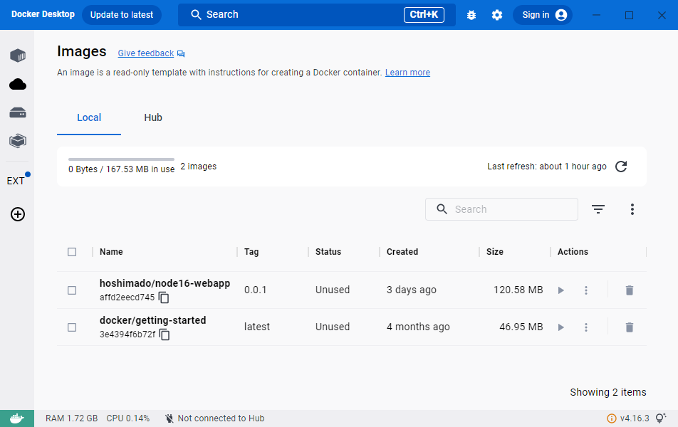
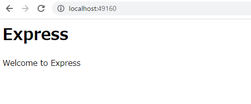
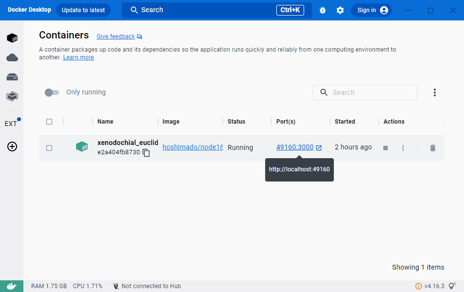
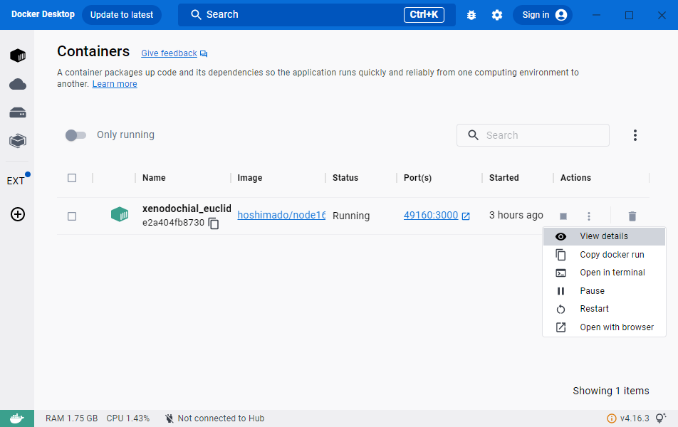

# タイトル

* Express.jsの軽量なDockerイメージの作成手順

# 概要

Express.jsでHello Worldする軽量なDockerイメージの作成方法と（120MBくらい）、
そのコンテナー起動方法を説明する。


# 目的

Node.js環境でExpress.jsを用いた簡単なWebアプリケーションをDockerイメージに格納し、
Docker環境で実行するまでの手順を理解すること。

## 想定読者

* Dockerとはなにか？は何となく理解しているが、実際にイメージ作成などはしたことがない方
    * 「Dockerとは、イメージを作成してコンテナーを起動できる環境」くらいの理解を想定
* アプリケーションをDockerイメージに格納する、という操作を初めてしようとする方
* Windows上のDocker環境を用いて、Dockerイメージ作成とコンテナー起動をやってみたい方


## 動作環境（検証環境）

* HW
    * Windows 10 Pro 22H2 (OSビルド19045) / Home 22H2 (OSビルド19045) 
    * メモリ：16GB / 4GB
* SW
    * Docker Desktop WSL2バックエンド v4.16.3　（※１）
    * WSL2 Ubuntu 22.04 LTS　（※１）
    * Node.js v16.13　（※２）

### 必要な動作環境に対する補足
* ※１：
    * Docker DesktopとWSL2の導入の詳細は、稚作の記事「[Windows上でDocker環境を作成する方法とその構成](https://qiita.com/hoshimado/items/51c99ccaee3d4222d99d)」を参照。
    * もちろん、Dockerが動作する環境があれば良いのであって、この記事に準ずる必要はない。

* ※２：
    * 節「[Express.jsでWebアプリを作成する](#expressjsでwebアプリを作成する)」でのNode.jsコード作成操作をスキップする場合は、動作環境に「Node.js」は不要。
        * なぜなら以降の作業は、Dockerのベース・イメージ内でのNode.js利用に閉じるため。
    * スキップする場合は、後述のサンプルコードのリポジトリから作成済みのExpress.jsのコードを取得して用いるか、同党のファイルで置き換えること。


# Dockerイメージの作成手順

次の順で作成する。

1. Express.jsでWebアプリを作成する
    * Hello World相当のもの
2. Dockerイメージを作成する手順を定義する（Dockerfileを作成）
3. Dockerイメージを作成する

イメージを作成するのファイルとフォルダ構造は次の通り。このうち、testフォルダ以外をDockerイメージに格納する。

```
+---src/
|   +---public/
|   +---routes/
|   +---app.js
|
+---test/
|
+---server.js
|
+---package.json
|
+---package-lock.json
|
+---.dockerignore
|
+---Dockerfile
```

作成済みのサンプルコードは[こちら](../)。


## Express.jsでWebアプリを作成する

ここでは「Welcome to Express」と表示するだけの実装とする。

[node.jsのExpressを導入するときの手順メモAzure前提](https://qiita.com/hoshimado/items/a009a58a6986d8826f0d)にしたがって、Express Generatorを用いて作成する。なお、リンク先の記事で「`express myapp --no-view`」と書いている個所は「`npx   express-generator myapp --no-view`」とすることで、事前のExpress-Generatorインストールは不要となる[^1]。

[^1]: https://expressjs.com/en/starter/generator.html


## Dockerイメージを作成する手順を定義する（Dockerfileを作成）

先ほど作成したWebアプリの`server.js`を配置したフォルダーに、「`Dockerfile`」というファイル名所のテキストファイルを作成する。
拡張子は無し。このテキストファイルを配置したフォルダーを基準に、Dockerイメージに対してWebアプリのファイルをこの後で格納していく。

Dockerfileには次のように記載する。[^2] [^3] [^4]

```Dockerfile
# ベース・イメージを指定する
FROM node:16-alpine3.16


# アプリケーションディレクトリを作成する
WORKDIR /usr/src/app


# アプリケーションの依存関係をインストールする
# ワイルドカードを使用して、package.json と package-lock.json の両方が確実にコピーされるようにします。
COPY package*.json ./


# 本番用に必要なモジュールのみをインストールする
RUN npm install --production


# アプリケーションのソースをバンドルする
COPY server.js  ./
COPY ./src/     ./src/


# リッスン対象ポート番号を設定する（暴露する）
EXPOSE 3000


# アプリケーションを起動する
CMD [ "node", "server.js" ]
```

[^2]: Node.js v16のDocker公式イメージを、ベースとして用いる。 - https://nodejs.org/ja/docs/guides/nodejs-docker-webapp

[^3]: イメージファイルのサイズを軽量にするため、派生のalpine版を用いる。 - https://github.com/nodejs/docker-node#create-a-dockerfile-in-your-nodejs-app-project

[^4]: 「`WORKDIR`」は作成するイメージファイル内の作業ディレクトリを指定する。ディレクトリが無ければ新規作成される。 - https://docs.docker.jp/engine/reference/builder.html#workdir


「Dockerイメージに含めないファイル」を指定するため、.dockerignoreファイルを作成して次のように記載する。

```.dockerignore
.git
*.log
node_modules
```


## Dockerイメージを作成する

先ほど作成したDockerfileを用いて、Dockerイメージファイルを作成する。
Dockerfileを置いてあるフォルダーで、コマンドラインから次のコマンドを実行する。
ここで「`hoshimado/node16-webapp:0.0.1`」はイメージの識別子であり任意の値で構わない。本記事では以降、この値を用いる[^5]。

```
docker build ./   -t hoshimado/node16-webapp:0.0.1
```

[^5]: Dockerイメージファイルを識別するための「リポジトリ名（イメージ名）」と「タグ名」を指定する。自動採番されるイメージIDの代わりに容易に対象を指定するための識別子。「レジストリ名称:タグ名称」のフォーマットで指定する。「タグ名称」は省略可能で、省略すると「latest」として扱われる。一般には「タグ名称」にはバージョンを記載する。「レジストリ名称」は「レジストリ名／イメージ名」の構成を取る事が多い。「レジストリ名」はDocker HubなどのDockerレジストリに登録した値を一般には用いるが、未登録でありローカルイメージに対するタグ付けなのでどんな値でも良い。識別のために本記事では「自身の名前（ハンドルネームなど）」としている。「イメージ名称」の命名規則に公式ルールはないが、一般に「小文字を用いる」「バージョンと要素はコロンで紐づける」「要素間はハイフンで区切る」「左から右へと詳細度を高くする（例：プラットフォーム名→アプリ名）」ように名づけることが多い。


初回の作成時は、ベース・イメージのダウンロードが走るので、少し時間がかかる。

```
D:\AsGitHub\docker-express>docker build ./   -t hoshimado/node16-webapp:0.0.1
[+] Building 119.5s (11/11) FINISHED
 => [internal] load build definition from Dockerfile                                                                                                            1.2s 
 => => transferring dockerfile: 669B                                                                                                                            0.3s 
 => [internal] load .dockerignore                                                                                                                               0.8s 
 => => transferring context: 67B                                                                                                                                0.0s 
 => [internal] load metadata for docker.io/library/node:16-alpine3.16                                                                                           8.2s 
 => [1/6] FROM docker.io/library/node:16-alpine3.16@sha256:81afe2f291e51e55fb055e8914495103095c3706e8ec3ff4e65be6f61a1471d9                                    50.8s 
 => => resolve docker.io/library/node:16-alpine3.16@sha256:81afe2f291e51e55fb055e8914495103095c3706e8ec3ff4e65be6f61a1471d9                                     0.5s 
 => => sha256:27f56734cabb1bf0ed5176730091b67fb59b0c7249193e350f175c8b4ab12f8d 1.16kB / 1.16kB                                                                  0.0s 
 => => sha256:81afe2f291e51e55fb055e8914495103095c3706e8ec3ff4e65be6f61a1471d9 1.43kB / 1.43kB                                                                  0.0s 
 => => sha256:88843c71ff110336441af8ceb68f04c0331e361accf0da9eba413f5976d8c792 6.49kB / 6.49kB                                                                  0.0s 
 => => sha256:91d30c5bc19582de1415b18f1ec5bcbf52a558b62cf6cc201c9669df9f748c22 2.81MB / 2.81MB                                                                  1.7s 
 => => sha256:60421a72b56a22cbec1526dc37dc6613674d518d774f8bb9469dea55e221d938 36.41MB / 36.41MB                                                               11.3s 
 => => sha256:69503fe8540587b0d8ed54cdcb999941c2be5aa8e361310edff2bf572fd1fbb7 2.35MB / 2.35MB                                                                  4.7s 
 => => extracting sha256:91d30c5bc19582de1415b18f1ec5bcbf52a558b62cf6cc201c9669df9f748c22                                                                      10.8s 
 => => sha256:49d088e724a928cd3a1bebf793a0aed833d1ef2d8bac5a24d8d9dc376eeb4605 451B / 451B                                                                      2.9s 
 => => extracting sha256:60421a72b56a22cbec1526dc37dc6613674d518d774f8bb9469dea55e221d938                                                                      26.1s 
 => => extracting sha256:69503fe8540587b0d8ed54cdcb999941c2be5aa8e361310edff2bf572fd1fbb7                                                                       2.2s 
 => => extracting sha256:49d088e724a928cd3a1bebf793a0aed833d1ef2d8bac5a24d8d9dc376eeb4605                                                                       0.0s 
 => [internal] load build context                                                                                                                               0.9s 
 => => transferring context: 75.84kB                                                                                                                            0.4s 
 => [2/6] WORKDIR /usr/src/app                                                                                                                                  1.8s 
 => [3/6] COPY package*.json ./                                                                                                                                 1.1s 
 => [4/6] RUN npm install --production                                                                                                                         43.9s 
 => [5/6] COPY server.js ./                                                                                                                                     1.7s 
 => [6/6] COPY ./src/ ./src/                                                                                                                                    2.4s 
 => exporting to image                                                                                                                                          6.1s 
 => => exporting layers                                                                                                                                         5.7s 
 => => writing image sha256:ba26cc7d3c0eaa3316b5d359641fe00b3b6381f6cf38d79b18b9cc95700be128                                                                    0.1s 
 => => naming to docker.io/hoshimado/node16-webapp:0.0.1                                                                                                        0.1s 

Use 'docker scan' to run Snyk tests against images to find vulnerabilities and learn how to fix them
```

イメージ作成が完了したら、次のコマンドで確認する。

```
docker image ls
```

次のように表示され、「hoshimado/hode16-webapp」イメージが作成されていることを確認できる。

```
REPOSITORY                TAG       IMAGE ID       CREATED        SIZE
hoshimado/node16-webapp   0.0.1     affd2eecd745   2 days ago     121MB
docker/getting-started    latest    3e4394f6b72f   4 months ago   47MB
```

なお、このイメージ一覧はDocker DesktopのGUI空も確認できる。




作成したDockerイメージの中身がどうなっているかを確認するには、次のコマンドを実行する。

```
docker run -it hoshimado/node16-webapp:0.0.1   /bin/sh   
```

このコマンドの実行結果として、次のことが行われる。

1. Dockerイメージ「hoshimado/node16-webapp:0.0.1」からDockerコンテナーを生成
2. Dockerコンテナーを起動
3. Dockerコンテナー内のbashシェルを実行

コンテナー内のbashシェルのプロンプト状態になるので、lsコマンドなりなんなりで中身を確認する（終えたら、`exit`で抜ける）。

なお、イメージ名「`hoshimado/node16-webapp:0.0.1`」の指定のところは、WSL側で実行することで入力補完で楽ができる（[イメージ名の入力補完](#dockerコマンドにおけるイメージ名の入力補完)）。


# Dockerイメージからのコンテナーの起動方法と動作確認方法

次の操作方法を説明する。

1. Dockerコンテナーを起動する
2. Dockerコンテナーを停止する
3. Dockerコンテナーを削除する
4. Dockerイメージを削除する


## Dockerコンテナーを起動する

作成したDockerイメージを用いて、イメージ格納したWebアプリを起動するには、次のコマンドを実行する。

```
docker run -p 49160:3000 -d hoshimado/node16-webapp:0.0.1
```

このコマンドの実行結果として、次のことが行われる。

1. イメージ「hoshimado/node16-webapp:0.0.1」からコンテナーを生成
2. そのコンテナーを起動する
3. 起動環境のポート46160で受け付けたものをコンテナー内のポート3000にマッピングする

コンテナーの起動状態を確認するため、次のコマンドを実行する。

```
docker ps -a
```

次のように表示される。この例であれば、コンテナーID「e2a404fb8730」で実行中であり、ポート49160で受け付けている（`0.0.0.0:49160->3000/tcp`）、ことを確認できる。

```
CONTAINER ID   IMAGE                           COMMAND                  CREATED          STATUS                     PORTS
NAMES
e2a404fb8730   hoshimado/node16-webapp:0.0.1   "docker-entrypoint.s…"   9 seconds ago    Up 3 seconds               0.0.0.0:49160->3000/tcp   
xenodochial_euclid
```

次のURLからブラウザーでアクセスすると、「Welcome to Express」と表示され、Dockerイメージ内に格納したWebアプリ（Express.jsサーバー）が動作している事がわかる。

```
http://localhost:49160/
```



コンテナーIDをキーとして、Dockerコンテナーの動作時のログを参照する。

```
docker container logs e2a404fb8730
```

いつもの、Express.jsの標準的なログ出力を確認できる。

```
GET / 304 6.142 ms - -
GET /stylesheets/style.css 404 3.355 ms - 160
GET /favicon.ico 404 1.035 ms - 150
```

### Docker Desktopからの参照方法

コンテナー起動時にマッピングしたポートへのアクセスは、Docker DesktopのGUIから簡単にすることもできる。



また、「Dockerコンテナーの動作時のログ」もDocker DesktopのGUIから「View details」で参照できる。




## Dockerコンテナーを停止する


次のコマンドで、Dockerコンテナーを停止できる。今回であれば、「`[CONTAINER ID]`」には「`e2a404fb8730`」が該当する。（Docker DesktopのGUIからタブ「コンテナー」を辿り、対象のコンテナーの「停止」ボタンを押してもよい）

```
docker container stop [CONTAINER ID]
```


## Dockerコンテナーの削除

次のコマンドで、Dockerコンテナーを削除する（Docker DesktopのGUIからタブ「コンテナー」から削除しても良い）。

```
docker container rm [CONTAINER ID]
```

WSL2側ならより簡単に[停止済みのDockerコンテナーを一括削除](#停止済みのdockerコンテナーを一括削除)することもできる。


## Dockerイメージの削除

次のコマンドで、Dockerイメージを削除する（Docker DesktopのGUIからタブ「イメージ」から削除しても良い）。。

```
docker image rm [IMAGE ID]
```

Dockerイメージからのコンテナーの起動と確認、終了操作の説明は以上。


# 小技とトラブルシューティング

## WSL2側で操作する

Windowsコマンドライン上ではなく、WSL2側に入って（`wsl`コマンドを引数無しで実行）からdockerコマンドを操作すると何かと便利。Linuxシェルの一般的な入力補完機能を利用できる。

### dockerコマンドにおけるイメージ名の入力補完

dockerコマンドでイメージ名を入力するとき、

```
docker run /bin/sh  -it [イメージ名の最初の数文字]
```

を入力した状態でTABキーを押すと、イメージ名を入力補完できる。


### 停止済みのDockerコンテナーを一括削除

シェルスクリプトの構文が使えるので、以下のコマンドで停止済みのコンテナーを一括削除可能。

```
docker container rm `docker ps -a -q`
```

ref. https://codechord.com/2019/08/docker-images-none-dangling/


### 利用されていない過去のイメージを一括削除

「Dockerイメージ」は、Docker buildするたびに増えていき、過去の「イメージが」「tag：None」として残ってしまう。
それらは不要なので、適宜「Dockerイメージ」を削除するとストレージを圧迫しなくて済む。

以下のコマンドで、「tag:None」となっているイメージを一括削除可能。

```
docker image prune
```

ref. https://codechord.com/2019/08/docker-images-none-dangling/


## Dockerコンテナー起動に失敗した場合

とりあえず以下を試してみる（私の環境ではこれで解決した）。

* WSL2を再起動する（コマンド「`wsl --shutdonw`」を実行する）
    * Docker Desktop側が「Restartするか？」と聞いてくるので、「Restartして」（Yes）で回答
* Docker Desktopを再起動する


