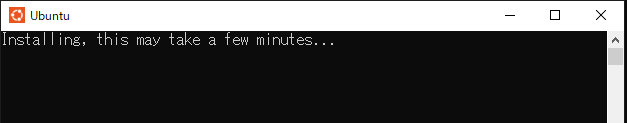

# タイトル

* Windows上でDocker環境を作成する方法とその構成


# 概要

Windows環境でDockerイメージとコンテナーを取り扱うための環境のセットアップ手順と、
その構成（Docker用語の定義を含む）を説明します。

Windows 10を前提としますが、Windows 11でも同様の見込みです。

本記事は「そのセットアップ手順で何が準備されるのか？」に注目して解説するので、
「セットアップできれば良い」を目的とする場合は冗長な内容となります。

なお、「Docker Desktopの利用条件」の説明は省略します（個人利用であれば無償で利用可能です）。


## 目的

本記事は以下を目的とします。

* 「Windowsコンテナー利用」と「Windows上でコンテナー利用」での意図するところ違い、などのDocker用語に関する混乱を解消すること
* Windows環境でLinuxコンテナーを動作する際の構成概要を把握し、Linux環境との差分を理解すること
* Windows 10環境でDockerコマンドを利用できるようにセットアップすること


## 想定読者

* Dockerとはなにか？は何となく理解しているが、実際にイメージ作成などはしたことがない方
    * 「Dockerとは、イメージを作成してコンテナーを起動できる環境」くらいの理解を想定
* Windows 10環境でDocker開発をしたい方
* Linux環境との差分が気になる方


## 動作環境（検証環境）

* HW
    * Windows 10 Pro 22H2 (OSビルド19045) / Home 22H2 (OSビルド19045) 
    * メモリ：16GB / 4GB
* SW
    * Docker Desktop v4.16.3
    * WSL Ubuntu 22.04 LTS


### （参考）Docker Desktop WSL2バックエンドのシステム要件

* Windows 11 64ビット： HomeかProバージョン21H2以上、EnterpriseかEducationバージョン21H2以上
* Windows 10 64ビット： HomeかPro 2004（ビルド19041）以上、EnterpriseかEducation 1909（ビルド18363）以上

ref. https://docs.docker.jp/desktop/windows/install.html#id3


# Windows環境でのDockerの構成

Windows 10環境でDockerを利用するには、次のものを準備します。

* Windows Subsystem for Linux 2（以降、WSL2と略記）
    * Docker Hostが動作するためのホストOS環境
* Docker Host
    * Dockerイメージ作成やコンテナー起動するための基盤
* Docker Client
    * Dockerイメージやコンテナーを操作するためのI/F

WSL2はWindows 10のオプション機能（設定で有効化する）として導入でき、
Docker HostとDocker Clientは「Docker Desktop for Windows」を用いて導入できます。


## Dockerの構成要素とは？

本節では、Docker周りの用語の整理をします。

単純に、Docker環境をセットアップすることが目的の場合は、
後半の節「[Docker環境のセットアップ手順](#docker環境のセットアップ手順)」まで読み飛ばしてください。


### 言葉の整理

本記事では、次の左列の用語はぞれぞれ右列の意図する、とします。

| 用語             | 意味するところ                        |
| ---------------- | ------------------------------------- |
| Dockerで開発     | DockerのLinuxコンテナーを利用して開発 |
| Dockerコンテナー | DockerのLinuxコンテナー               |
| Docker Desktop   | Docker Desktop WSL2バックエンド     |

わざわざ断ったのは、これらの用語に次のような揺れがあるためです。

* 「Dockerコンテナー」には、「DockerのLinuxコンテナー」と「DockerのWindowsコンテナー」がある
* 「Docker Desktop」は「Windows向け」と「Mac向け」があり、且つ「Windows向け」には「Windows Hyper-V向け」と「WSL2向け」がある

「Docker」とは「Docker社（旧dotCloud）が開発するコンテナーのアプリケーション実行環境を管理するオープンソースソフトウェア（OSS）」[^1]です。
「Dockerコンテナー」とは「Dockerにおけるコンテナー実装」であり、「コンテナー」は「コンテナー型仮想化技術」のことです。
「コンテナー」はWindowsにおける実装である「Windowsコンテナー」とLinuxにおける実装である「Linuxコンテナー」があり[^2]、一般には「Linuxコンテナー」のことを指す場合が多いです。多いですが、両者があり得るため上述のように整理しました。なお、Docker自体は「Linuxコンテナー」だけなく「Windowsコンテナー」もサポートしています。
「Linuxコンテナー」は、UNIX系のOS[^3]が有する「namespaces」と「cgroups」という機能に基づいたコンテナー実装であり、その実装形式はいくつの種類があります。
「Dockerコンテナー」は「DockerによるLinuxコンテナー実装」を意味します。

[^1]: Docker is an open platform for developing, shipping, and running applications. [https://docs.docker.com/get-started/overview/](https://docs.docker.com/get-started/overview/)

[^2]: より正確には、「LinuxやFreeBSDにおける実装があり」と言う記載すべきだが、基づく技術が同一のため略する。

[^3]: Linux、FreeBSD、macOS、SolarisなどOSのこと。


## Windows上でLinuxコンテナーを動作させるには？

次の2つのいずれかの方法を用いることで、Windows上で「Dockerコンテナー」（Linuxコンテナー）を動作できます。

* Hyper-Vの上にLinux OSをインストールしたうえで、そのLinux OS環境にDockerをインストールする
* WSL2の上にLinux OSをインストールしたうえで、そのLinux OS環境にDockerをインストールする

「Docker Desktop」は双方の形式へのセットアップをサポートしています。
前者はHyper-Vが必須となるため、Proエディション以上が必須です。
後者はWSL2が必須ですが、WSL2はWindows 10 Homeでも利用可能であるためエディションを問わずに利用可能です。
本記事では、Windows 10 Pro版に限らずWindows 10 Home版でも動作な後者の「Docker Desktop WSL 2バックエンド」を採用するものとします。


## Docker環境の構成

「Docker」は「コンテナーの実行環境とその管理ツール」の一式です。
クライアント・サーバーアーキテクチャを有しており、
Dockerコンテナーの起動やその元となるDockerイメージの作成と管理等を行う基盤である「Docker Host」と、Dockerイメージの配布のための格納場所である「Registry」、そしてDocker Hostに対して操作の指示をするためのコマンドライン・インターフェイスである「Docker Client」と言う構成を取ります。

* Docker Host
    * Docker daemon
        * Docker Clientからの指示を受けて、Docker Objectsの操作と管理を行う
        * Docker Clientからの指示に従い、Docker ImageをRegistryへ格納する
    * Docker Object
        * Docker Image
        * Docker Container
* Docker Client
    * Docker CLIコマンド
        * docker build
        * docker image \[コマンド\]
        * docker container \[コマンド\]
        * docker compose \[コマンド\]
        * ・・・
    * 定義ファイル
        * dockerfile
        * compose.yml
* Registry
    * Docker Hub
    * （AWS ECR）
    * （Azure Container Registory）

Windows 10環境でDockerを用いた開発を行うには、上記のうち「Docker Host」と「Docker Client」をセットアップします。[^4]

[^4]: サーバークライアント型アーキテクチャのため「Docker Host」と「Docker Client」は同一環境にある必要はありません。両者はREST APIで通信する仕様であり、通信が可能であれば異なる環境に導入できます。今回はとくに分ける必要もないので、同一の環境に導入します。 - [https://docs.docker.com/get-started/overview/#docker-architecture](https://docs.docker.com/get-started/overview/#docker-architecture/)


## Docker HostとDocker Clientの導入方法

Docker Desktopを用いると、Windows 10環境へ容易に「Docker Host」と「Docker Client」の一式をセットアップできます[^5]。一式には次のものが含まれています。

* Docker daemon
* Docker CLI
* Docker Composeプラグイン
* Kubernetes
* ・・・

したがって、Dockerイメージの作成とコンテナーの起動といった基本操作だけでなく、複数コンテナーの起動管理（Compose）や、コンテナーの運用管理（Kubernetes）も行えるようになります[^6]。

また、Windowsコマンドライン上で動作する「Docker CLI」も提供してくれるため、「WSL2環境で動作しているDocker Host（Docker daemon）」にたいして「Windows 10コマンドラインで動作するDocker Client」から操作を行えるようになります。WSL2を意識せずに行えるため、便利です。


[^5]: Docker Desktop is a one-click-install application for your Mac, Linux, or Windows environment that enables you to build and share containerized applications and microservices. - https://docs.docker.com/desktop/

[^6]: Docker Desktop includes the Docker daemon (dockerd), the Docker client (docker), Docker Compose, Docker Content Trust, Kubernetes, and Credential Helper. - https://docs.docker.com/get-started/overview/#docker-desktop

Docker Desktopを用いず、WSL2環境へ直接Docker HostとDocker Clientをセットアップすることもできますが、その場合は「Linux上でコマンドラインからDockerをセットアップする」ことと同義となります。したがって、複数のモジュールを順にインストールしサービスの開始処理する等の手間がかかります[^7]。Windows 10での利用に際して、開発に必要なモジュール一式をまとめてセットアップしてくれるDocker Desktopを用いる方法を、本記事では採用します。

[^7]: `sudo apt-get install docker-engine`でDocker daemonとDocker CLIのCore部分をインストールし、`sudo apt-get install docker-compose-plugin`でDocker CLIのCompose機能をインストールし、、、とDockerの機能構成を理解して進める必要があります。- https://docs.docker.jp/compose/install/compose-plugin.html


# Docker環境のセットアップ手順

次の順に、必要モジュールのセットアップを行います。

1. WSL2を有効化し、Ubuntuをダウンロードしてセットアップする
2. Docker Desktop (Docker Desktop for Windows) をインストールする

セットアップ途中で、Ubuntuでのログインユーザー名称とパスワードの設定を求められますので、あらかじめ準備しておいてください（任意のユーザー名とパスワードで構いません）。


## WSL2の有効化とUbuntuのセットアップ

※すでに「WSL1を利用中」の環境の場合は手順が異なります。節「[（補足）WSL1をすでに利用中の場合のWSL2有効化の方法](#補足wsl1をすでに利用中の場合のwsl2有効化の方法)」を参照してください。

Docker Desktopのインストールを行う前にWSL2を有効化し、Linuxのディストリビューションをセットアップします[^8]。
具体的には次のようにします。

1. 管理者権限のコマンドラインを開き、次のコマンドを実行します[^9]。

```
wsl --install
```

2. LinuxのUbuntuディストリビューションのダウンロードとインストールまでが自動で実行され、OS再起動を要求されます。要求メッセージに従いOSを再起動します。


```
C:\Windows\system32>wsl --install
インストール中: 仮想マシン プラットフォーム
仮想マシン プラットフォーム はインストールされました。
インストール中: Linux 用 Windows サブシステム
Linux 用 Windows サブシステム  はインストールされました。
インストール中: Linux 用 Windows サブシステム
Linux 用 Windows サブシステム  はインストールされました。
インストール中: Ubuntu
Ubuntu はインストールされました。
要求された操作は正常に終了しました。変更を有効にするには、システムを再起動する必要があります。

C:\Windows\system32>
```

3. OS再起動後、自動でUbuntuインストールの続きが始まります（数分かかります）。完了するとUbuntuで利用するユーザー名とパスワードの設定を求められるので、任意の値を入力します。
    * ここで設定したユーザー名とパスワードは忘れないようにしてください（本記事の解説の範囲内で利用しませんが、その後のDocker開発でWSL2上の操作をする際には必要となることがあります）


4. [x64 マシン用 WSL2 Linux カーネル更新プログラム パッケージ](https://wslstorestorage.blob.core.windows.net/wslblob/wsl_update_x64.msi)をダウンロードして実行します。

5. （念のため）OSを再起動しておきます。


以上でWSL2側の準備は完了です。次は節「[Docker Desktopのインストール](#docker-desktopのインストール)」に進みます。


[^8]: Docker Desktop WSL 2バックエンドをインストールする前に、以下の手順を完了している必要があります。- https://docs.docker.jp/docker-for-windows/wsl.html

[^9]: このコマンドにより、WSL2動作に必要な設定が行われ、LinuxのUbuntuディストリビューションがインストールされます - https://learn.microsoft.com/ja-jp/windows/wsl/install


### （補足）「wsl --install」コマンドで実施されること

コマンド「`wsl --install`」によって実行される内容は次の3つです[^10]。

* Linux用Windowsサブシステムの有効化
* 仮想マシンの機能の有効化
* Ubutunのダウンロードとインストール


[^10]: コマンド「`wsl --install`」を使用する代わりに、以前のバージョンのWSLの手動インストール手順を行う場合。 - https://learn.microsoft.com/ja-jp/windows/wsl/install-manual

最初の2つの設定変更の操作は、管理者権限のコマンドラインから次のように行うことができます。

```
dism.exe /online /enable-feature /featurename:Microsoft-Windows-Subsystem-Linux /all /norestart

dism.exe /online /enable-feature /featurename:VirtualMachinePlatform /all /norestart
```

この2つのコマンド操作は、以前はコントロールパネルから次の設定で操作を案内されていた内容と等しいです。


### （補足）WSL1をすでに利用中の場合のWSL2有効化の方法

すでにWSL1を利用中の場合（インストール済みの場合）、コマンド「`wsl --instal`」でのインストールは動作しません。実行すると「WSLヘルプ」のテキストが表示されてしまいます。

この場合は、この場合は、次の節「[WSL1利用中の環境にWSL2を追加する（有効化する）](#wsl1利用中の環境にwsl2を追加する有効化する)」から説明する手順でWSL2に必要な設定を明示的に有効化したのちにWSL2用のUbuntuをインストールします[^11] [^12]。

なお、WSL1とWSL2は共存が可能です（WSL2有効化後の、WSL1の起動方法は後述）。ただしWSL1でのDocker動作は保証されないので注意ください（少なくとも当方の環境では、WSL2追加後は動作しなくなりました）。

[^11]: `wsl --install`コマンドが利用できるようになる前にWSLを手動でインストールした場合は、WSL2で使用される仮想マシンのオプション コンポーネントを有効に - https://learn.microsoft.com/ja-jp/windows/wsl/install#upgrade-version-from-wsl-1-to-wsl-2

[^12]: 【検索して】WSL1とWSL2の共存【なぞっただけ】 - https://qiita.com/query1000/items/04409b8e28793a9407d0


### WSL1利用中の環境にWSL2を追加する（有効化する）

WSL1が存在する環境に、WSL2用の設定を追加する手順は次です。

1. 仮想マシンの機能を有効にする（WSL1では不要だったので改めて有効化）[^13]
2. 「x64マシン用WSL2 Linuxカーネル更新プログラム パッケージ」をインストール[^14]
3. WSL 2を既定のバージョンとして設定する[^15]

[^11]: `wsl --install`コマンドが利用できるようになる前にWSLを手動でインストールした場合は、WSL2で使用される仮想マシンのオプション コンポーネントを有効に - https://learn.microsoft.com/ja-jp/windows/wsl/install#upgrade-version-from-wsl-1-to-wsl-2

[^12]: 【検索して】WSL1とWSL2の共存【なぞっただけ】 - https://qiita.com/query1000/items/04409b8e28793a9407d0

[^13]: https://learn.microsoft.com/ja-jp/windows/wsl/install-manual#step-3---enable-virtual-machine-feature

[^14]: https://learn.microsoft.com/ja-jp/windows/wsl/install-manual#step-4---download-the-linux-kernel-update-package

[^15]: https://learn.microsoft.com/ja-jp/windows/wsl/install-manual#step-5---set-wsl-2-as-your-default-version

具体的には次のようにします。

管理者権限のコマンドラインから次のコマンドを実行します。

```
dism.exe /online /enable-feature /featurename:VirtualMachinePlatform /all /norestart
```

続いて、[x64 マシン用 WSL2 Linux カーネル更新プログラム パッケージ](https://wslstorestorage.blob.core.windows.net/wslblob/wsl_update_x64.msi)をダウンロードして実行後、OSを再起動します。

再起動を終えたら、コマンドラインから次のコマンドを実行します。

```
wsl --set-default-version 2
```


以上で、WSL2の有効化は完了です。
次のコマンドを実行すると、セットアップされているディストリビューションの一覧を確認できます。

```
wsl --list -v
```

WSL2用のディストリビューションのセットアップ前なので、WSL1の既存のディストリビューション
のみが表示されるはずです。
WSL1のディストリビューションが仮に「Ubuntu-16.04」の場合は、次のコマンドで「WSL1としての起動」が可能です。

```
wsl -d Ubuntu-16.04
```

続いて、WSL2用ディストリビューションの追加へ進みます。


### WSL2用のUbuntuを手動セットアップ

コマンドラインから次のコマンドを実行して、UbuntuのWSL2向けディストリビューションをインストールします。

```
wsl --install -d Ubuntu
```

ダウンロード処理が走るので、しばらく待ちます。


完了すると、WSL1とWSL2が同居した状態になります。

```
C:\WINDOWS\system32>wsl --list -v
  NAME            STATE           VERSION
* Ubuntu-16.04    Stopped         1
  Ubuntu          Stopped         2
```

コマンドラインで単純に「`wsl`」と打った場合は、「*」がついているデフォルトのディストリビューションが起動します[^16]。
次のコマンドを実行して、デフォルトを先ほどインストールしたWSL2モードのUbuntuへ変更しておきます。

```
wsl --set-default Ubuntu
```

[^16]: 任意のディストリビューションを起動するには、「`wsl -d Ubuntu-16.04`」などのように「NAME」を明示的に指定する。

最後に、WSL2で利用するディストリビューションを最新化するために、次のコマンドを実行します（この「最新化」はWSL2が対象です）。

```
wsl --update
```


## Docker Desktopのインストール

次のページの案内（節「ダウンロード」のところ）にしたがって飛んだ先のページから
「Docker Desktop for Windows」をダウンロードします。

https://docs.docker.jp/docker-for-windows/wsl.html

先のページ内に記載の
「インストールする前に、以下の手順を完了している必要があります」
の内容は、
先の節「[WSL2の有効化とubuntuのセットアップ](#wsl2の有効化とubuntuのセットアップ)」で実施済みの内容です。
なので、ダウンロードしたexeファイルをそのまま実行してインストールに進みます[^17]。

Docker Desktopのインストール中に「WSL2を有効化するか？（WSL2を利用するか？）」を
聞いてくる画面が出たら画面の案内にしたがってWSL2の利用を選択します（Home等で選択の余地がない場合は選択肢は出ません）[^18]。

[^17]: 稀に？インストーラーが起動エラーする場合がある。その場合は、すこし古いバージョンに遡って取得して実施する。

[^18]: インストール完了後に変更することも可能。Docker Desktopのメニューから「Setting ＞ General ＞ User WSL 2 based engine（WSL2対応エンジンを使う）」で切り替える。

次の画面が出ればインストールは完了です。画面の要求にしたがってログアウトした後、再ログインします。


このあとに、利用規約への同意確認ダイアログが表示させるので、内容を読んで同意します。

Docker Desktopのメニューから「Setting ＞ General ＞ Start Docker Desktop when you log in」を確認します。この設定のデフォルトが「On（OSアカウントへログイン時にDocker Desktopを起動する）」になっていることがあります。
普段から恒常的にDockerコンテナーを起動することが目的でない限りは、普段は「起動しない」設定が望ましいでしょう[^19]。このチェックを外すことで、「起動しない」設定にできます。最初から外れている場合はそのままで設定を閉じます。

[^19]: WSL2のLinux OSが意図せずメモリを確保してしまい、他の作業が圧迫される、ようなことが起こるためです（デフォルト設定では、実装メモリの80％まで確保し得る）。適切に設定でガードはできますが、使う時だけ明示的に起動する運用を筆者はしています。


以上で、Docker Desktopのセットアップは完了です。
これで、WindowsのコマンドラインからDockerコマンドを叩けるようになりました。

# Docker環境の動作確認

Dockerイメージ「docker/getting-started」からDockerコンテナーを起動することで、環境の動作確認をします。具体的には、Docker Desktopのトップ画面に案内のある次のコマンドをコピーして、コマンドラインで実行します。

```
docker run -d -p 80:80 docker/getting-started
```


初回はイメージのダウンロードが走ります（60MBくらい）。

```
C:\Users>docker run -d -p 80:80 docker/getting-started
Unable to find image 'docker/getting-started:latest' locally
latest: Pulling from docker/getting-started
c158987b0551: Pull complete
1e35f6679fab: Pull complete
cb9626c74200: Pull complete
b6334b6ace34: Pull complete
f1d1c9928c82: Pull complete
9b6f639ec6ea: Pull complete
ee68d3549ec8: Pull complete
33e0cbbb4673: Pull complete
4f7e34c2de10: Pull complete
Digest: sha256:d79336f4812b6547a53e735480dde67f8f8f7071b414fbd9297609ffb989abc1
Status: Downloaded newer image for docker/getting-started:latest
c6cbdb95486e2447d0628dcc8f5af8a5c330df2c19bde38a24e30fa4b0ddf9f0
```

ブラウザで次のURLへアクセスすると、先のコマンドで実行したコンテナー「`docker/getting-startd`」で提供されるWebサイトが表示されます。

```
http://localhost/
```

起動中のコンテナーはDocker Desktopの「コンテナー」タブに表示されます。「■」ボタンを押して停止することが出来ます。


以上です。


# トラブルシューティング

Docker Desktop起動時に次のようなエラーダイアログが出て起動しないことがあります。

```
A timeout occured while waiting for a WSL integration agent to become ready.
```

```
Docker.Core.HttpBadResponseException:
```


この現象となる原因は様々らしいですが、当方の環境では次の手順を実施すると解決できたので、記載しておきます[^20]。

1. Docker Desktopを終了する
2. WSL2をコマンド「`wsl --shutdown`」で明示的に終了する
3. 管理者権限のコマンドラインから「`netsh winsock reset`」を実行して、Windows Sockets APIの設定情報を初期化
4. 念のためOSを再起動
5. Docker Desktopを改めて起動

ref. https://github.com/docker/for-win/issues/13236

[^20]: 「WSL2バックエンドへのAgent構築がタイムアウト」というエラー内容なので、WSL2とWindows側のモジュールとの通信エラーと推定される。Host/Client間の通信がREST APIであるので恐らく他も順じているだろうと推測できるので、Windows Sockets APIの設定初期化と言うアプローチは、まぁ妥当？


