# qiita-express-passport-oidc-gcp-azure

Subject: ExpressとPassportによる実装クライアントで、複数のOpenID Connect認証を試してみる（Google/Azure/Yahoo）


# 概要

複数（Google/Azure/Yahoo）のサービスが提供する、OpenID Connect（以下、「OIDC」と略記）のIdentity Provider（以下、「IdP」と略記）に対して、実際にIdP側に設定・登録する内容とRelying Party(以下「RP」と略記）側への反映について説明する。

OIDCのIdP提供元によってIdP側の設定手順や呼称が異なるため、OIDCのクライアントID、シークレットキーと「実際のIdp側の操作画面の紐づけ」を目的とする。

本記事ではRP側の実装は同一とし、認証要求先のIdPの設定に応じてそれぞれのOIDC認証が動作することを検証する。PR側は、Node.jsのExpressを使ったWebページ上にPassportを使って簡単に実装したサンプルを用いる。

本記事で用いるPR側のサンプル実装コードは、以下を参照。

https://github.com/hoshimado/qiita-notes/tree/main/qiita-express-passport-oidc-gcp-azure

なお、上記の「PRのサンプルコード」は以下の記事で作成したモノをベースに、複数IdPの情報を設定するために少し修正したものであり、設計はほぼ同一なので説明は省略する。

https://qiita.com/hoshimado/items/fbdd66bed304f442d2d5

※自身でPRを作成済みであり、読み替えが出来るのであれば、本サンプルを利用する必要はない。
※本サンプルは試行であり、それぞれのログインボタンを推された瞬間にPassportのStrategyをGoogle/Azure/Yahooへ切り替えて、それぞれのOIDC認証が終了するまでに他のアクセスが【来ないことを前提とする】実装、であることに注意。


本記事は以下を前提とする。

* 認証フローは「認可コードフロー（RFC 6749, 4.1. Authorization Code Grant）」を使う
* IDトークンの取得には「POST形式（RFC6749, 9. Client Authentication にある client_secret_post）」を使う
* OIDCのIDプロバイダーとして、以下について試行する
  * Google Cloud Platform（以下、「GCP」と略記）
    * https://cloud.google.com/
  * Microsoft Azure（以下、「Azure」と略記）
    * https://portal.azure.com/
  * Yahoo! ID連携 v2（以下、「Yahoo」と略記）
    * https://e.developer.yahoo.co.jp/dashboard/


PRのサンプルコードで使うライブラリは以下。

* Express
  * https://expressjs.com/ja/
* Passport
  * http://www.passportjs.org/
* Passport-OpenID Connect
  * https://github.com/jaredhanson/passport-openidconnect


# サンプルコードの動作環境

以下の通り。

```
  "dependencies": {
    "cookie-parser": "~1.4.4",
    "debug": "~2.6.9",
    "express": "~4.16.1",
    "express-session": "^1.17.2",
    "morgan": "~1.9.1",
    "passport": "^0.5.0",
    "passport-openidconnect": "0.0.2"
  },
  "devDependencies": {
    "cross-env": "^7.0.3",
    "node-dev": "^7.1.0"
  }
```

# 各種OIDCのIdPへの登録方法について

PRとしてOIDC認証を行うには、IdP提供元のいわゆる「openid-configuration」情報（EndPointとサポートする形式）と、PR個別に以下の登録が必要となる。

* クライアントID
* クライアントシークレットの
* コールバックURI

以下の節で、それぞれのIdP提供元（GCP/Azure/Yahoo）ごとの情報と登録方法について説明する。

なお、いずれのIdP側の操作画面は2021-11-27時点のものである。

## GCPが提供するOIDC IdPを利用する方法

GCP（Google）が提供するOIDC認証を行うIdPの情報は、以下に記載されている。

* Google Identity Platform ＞OpenID Connect
  * https://developers.google.com/identity/protocols/oauth2/openid-connect

具体的には、上記にて示されている下記を参照する。

  * https://accounts.google.com/.well-known/openid-configuration

上記を参照して、本サンプルコードでは、passport-openidconnectの提供するStrategyインスタンスのConfigureへ、次ように設定する（ClientIDやclientSecret等は環境変数経由で設定するものとして、後述する）。

```
var Instance4GoogleOIDC = new OpenidConnectStrategy(
    {
      issuer: "https://accounts.google.com",
      authorizationURL: "https://accounts.google.com/o/oauth2/v2/auth",
      tokenURL:         "https://oauth2.googleapis.com/token",
      userInfoURL:  "https://openidconnect.googleapis.com/v1/userinfo",
      clientID:     oidcConfig.CLIENT_ID,
      clientSecret: oidcConfig.CLIENT_SECRET,
      callbackURL:  THIS_ROUTE_PATH + '/' + oidcConfig.REDIRECT_URI_DIRECTORY,
      scope: ["openid", "profile"]
    }, function(){ /* 省略 */ } );
```

続いて、クライアントIDとクライアントシークレットの設定方法を説明する。

GCPにアクセスして、Googleアカウントでログインする。

https://cloud.google.com/

右上の「コンソール」ボタンを押してGCPコンソールに移動する。

「ダッシュボード」が表示されるので、左ペインの「APIとサービス」を押下する。

「OAuth2.0認可によるAPIアクセス情報の管理ページ」に移動する。

これは「プロジェクト」単位での管理となるため、初回だと「新規プロジェクトの作成」画面が表示される。任意のプロジェクト名（「変更できない～」と書かれているのは、プロジェクトのObject IDのことで、プロジェクト名称、の事ではない）を入力して「作成」する。場所は、今回は試行なので「組織なし」のままでよい。

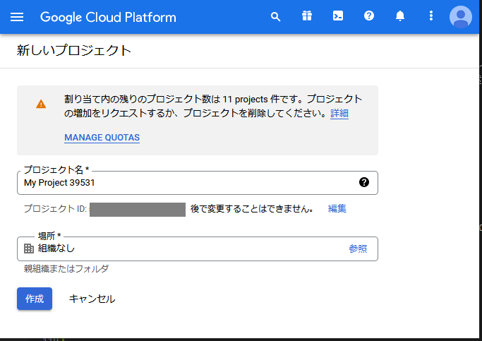

「作成」を押すとダッシュボードのページへ移動して、作成完了となる。

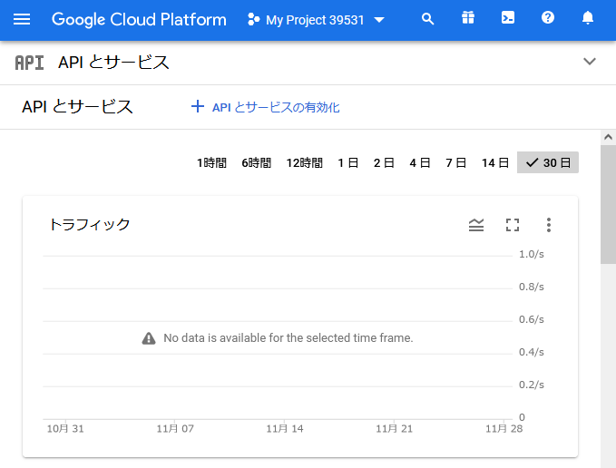

なお、OIDCのIdP機能を利用するだけなので「APIとサービスの有効化」は不要。

続いて、「OAuth同意画面」へ移動する。
右上のドロップダウンアイコンか、もしくは左上のハンバーガーメニューから「APIとサービス＞OAuth同意画面」へ移動する。

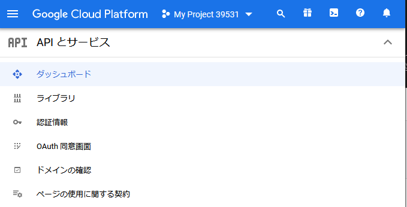


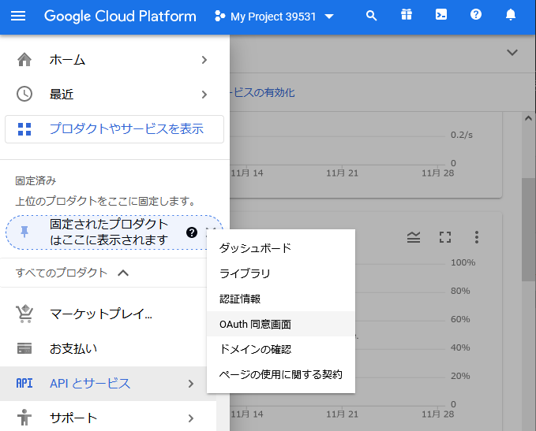

「OAuth同意画面」の作成に必要な情報を入力する（もちろん後でからも編集可能）。
* User Type
  * 本試行では「Googleアカウントを持っている人」を対象とするので「外部」を選択
* アプリ情報
  * OIDCで利用者に対して「こういうアプリから、認証を求められています」と表示する情報
  * アプリ名とユーザーサポートメール、ディベロッパーの連絡先情報、が入力必須
  * 承認済みドメイン、は後から「認証情報」のところで設定するので、ここでは【入力不要】
* スコープ
  * 「APIとサービス」を利用せず、認証機能のみ利用なので、デフォルトのままで「保存して次へ」進む
* テストユーザー
  * 「スクープ」と同様に、今回は使用しないのデフォルトのままで「保存して次へ」進む  

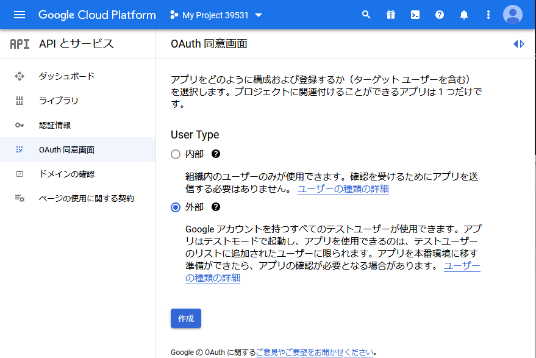

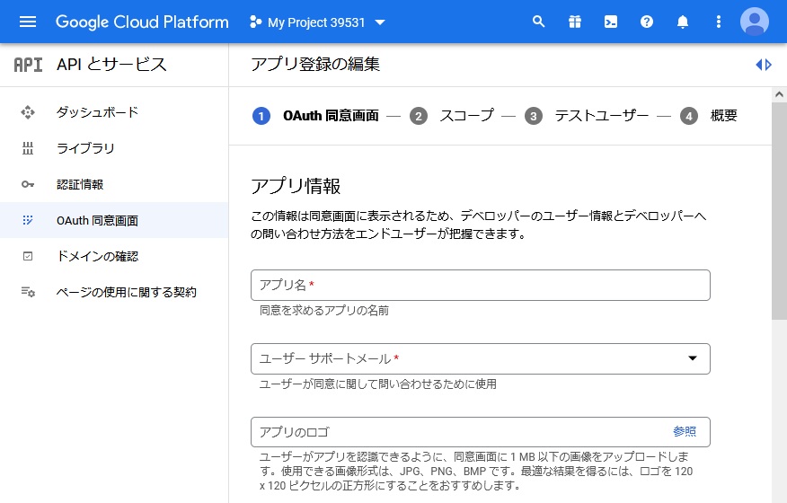

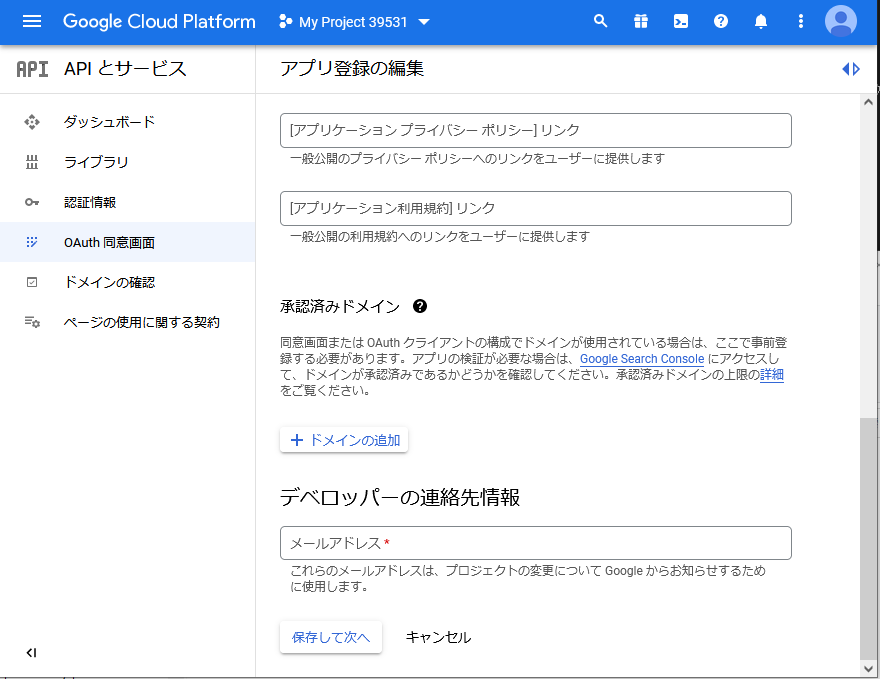

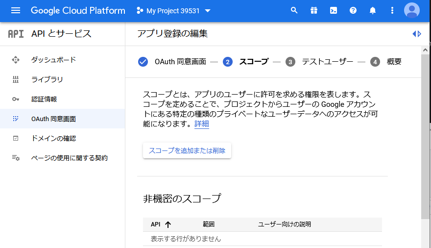

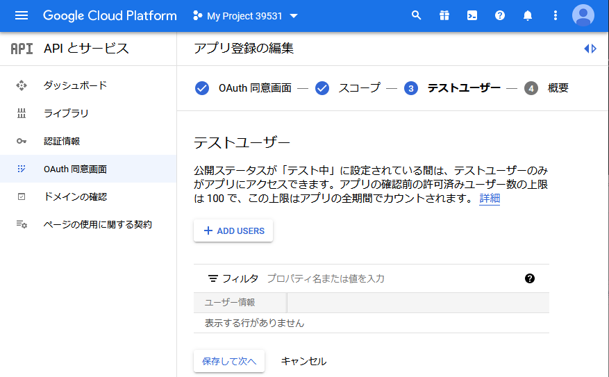

最後に（今まで入力した内容の確認として）「概要」が表示されたら、一番下までスクロールして「プロジェクトに戻る」ボタンを押せば「OAuth同意画面」の作成は完了。

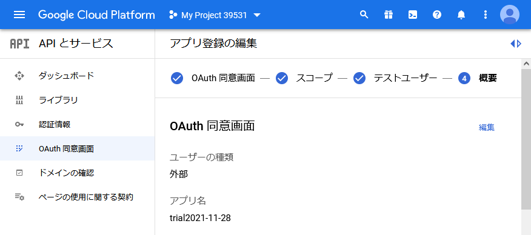

続いて、「認証情報」からOIDCするRP向けの「クライアントID」と「クライアントシークレット」を作成する。
なお「認証情報」を作成するには、あらかじめ「OAuth同意画面」を作成して置く必要があり、未作成の場合は「OAuth同意画面を構成してください」と求められる（ので先ほど作成した）。

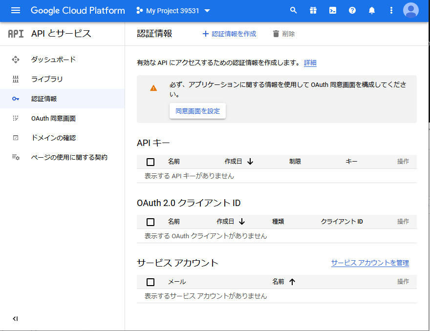

左ペインの「認証情報」、そのメニューが無い場合は左上のハンバーガーメニューから「APIとサービス＞認証情報」をクリックして移動する。
作成するのは「OAuth 2.0 クライアント ID」で、上部の「認証情報を作成」をクリックしてドロップダウンするメニューから「OAuth 2.0 クライアント IDの作成」を選択する。

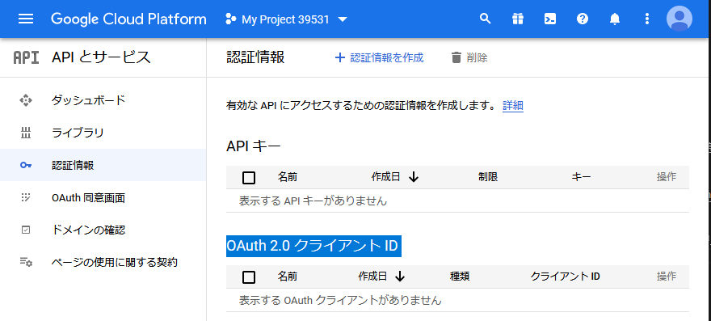

OAuthクライアントIDを割り当てるアプリケーションの種類を聞かれるので、本サンプルの場合は「ウェブ アプリケーション」を選択する。

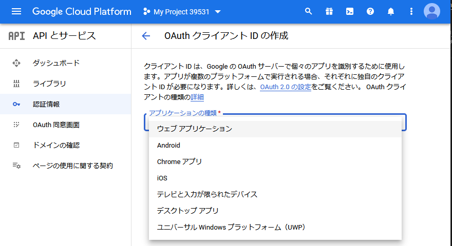

すると、「承認済みのリダイレクトURI」を入力できるようになるので「＋URIを追加」を押して、OIDCでのIdPからのcallback先のURLを入力する。本サンプルでは、具体的には以下を入力する。複数指定できるので、クラウド上に公開するときは、そちらのcallback先URLも追加すること（※IdPへのリダイレクト時に「ｘｘにcallbackして」とURLクエリーで指定するわけだが、それを「信用してよいか？（承認してよいか？）」をここで設定している）。

```
http://localhost:3000/auth-gcp/callback
```

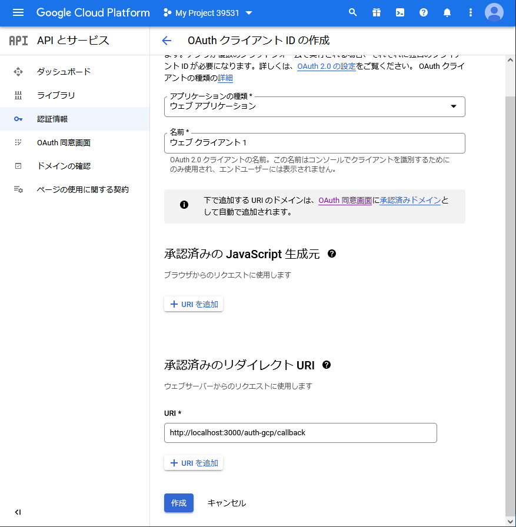

「名前」はRPクライアントを識別するためのものなので、任意に入力する。
入力を終えたら、一番下の「作成」ボタンを押すと、「クライアントID」と「クライアントシークレット」が払い出されるので、これをメモする。「クライアントシークレット」はここでしか参照できないので【忘れずにメモ】すること。

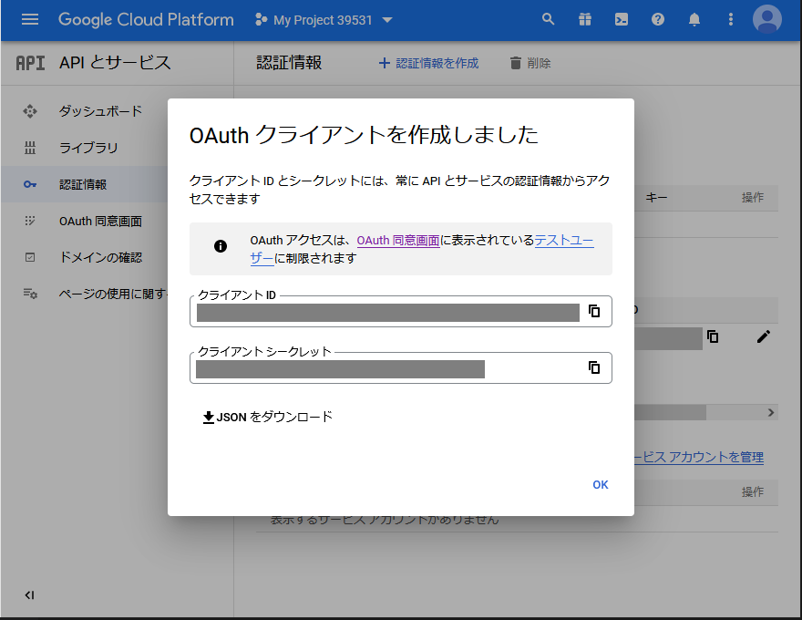

なお、「クライアントID」の参照と「承認済みのリダイレクトURI」の追加は後からも出来て、「APIとサービス＞認証情報＞OAuth2.0クライアントID」の欄から編集アイコンをクリックして操作が可能。

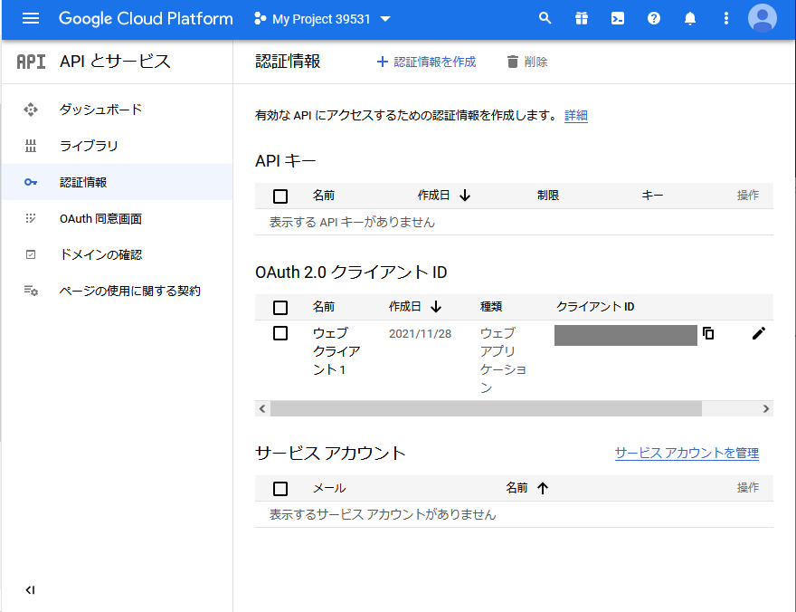

以上で、IdPへの「クライアントID」と「クライアントシークレット」の登録（作成）が終わったので、これをPRに設定する。本サンプルでは環境変数を経由して設定するので、例えば、以下のようにしてサンプルコードを起動すればよい。

```
SET GCP_CLIENT_ID=【作成したクライアントID】
SET GCP_CLIENT_SECRET=【作成したクライアントシークレット】

npm run dev
```


## Azureが提供するOIDC IdPを利用する方法

Azure（Microsoft）が提供するOIDC認証を行うIdPの情報は、以下に記載されている。

* Microsoft ID プラットフォームのドキュメント＞クイック スタート:Microsoft ID プラットフォームにアプリケーションを登録する
  * https://login.microsoftonline.com/consumers/v2.0/.well-known/openid-configuration

具体的には、上記に記載の手順に従ってAzureポータルにログインした先から辿れる下記を参照。

* https://login.microsoftonline.com/consumers/v2.0/.well-known/openid-configuration


※なお、上述の「クイックスタート」の先にある以下の「Node.js Webアプリのチュートリアル」では、Azure提供の認証ライブラリ「`Microsoft Authentication Library for Node (msal-node)`」を利用しているが、本記事では「他のOIDCのIdPと共通の実装から利用する」ことを目的とするので、こちらではなく、冒頭に記載した「`Passport-OpenID Connect`」を用いる。

* Node.js Webアプリケーションのチュートリアル
  * https://docs.microsoft.com/ja-jp/azure/active-directory/develop/tutorial-v2-nodejs-webapp-msal
* Microsoft Authentication Library for Node (msal-node)
  * `@azure/msal-node`
  * https://www.npmjs.com/package/@azure/msal-node
  * https://github.com/AzureAD/microsoft-authentication-library-for-js


上記のIdPの情報（ openid-configuration ）参照して、本サンプルコードでは、passport-openidconnectの提供するStrategyインスタンスのConfigureへ、次ように設定する（ClientIDやclientSecret等は環境変数経由で設定するものとして、後述する）。

```
var Instance4AzureOIDC = new OpenidConnectStrategy(
    {
      issuer: "https://login.microsoftonline.com/9188040d-6c67-4c5b-b112-36a304b66dad/v2.0",
      authorizationURL: "https://login.microsoftonline.com/consumers/oauth2/v2.0/authorize",
      tokenURL:         "https://login.microsoftonline.com/consumers/oauth2/v2.0/token",
      userInfoURL:  "https://graph.microsoft.com/oidc/userinfo",
      clientID:     oidcConfig.CLIENT_ID,
      clientSecret: oidcConfig.CLIENT_SECRET,
      callbackURL:  THIS_ROUTE_PATH + '/' + oidcConfig.REDIRECT_URI_DIRECTORY,
      scope: ["openid", "profile"]
    }, function(){ /* 省略 */ } );
```

続いて、クライアントIDとクライアントシークレットの設定方法を説明する。

Azureポータルにアクセスして、Microsoftアカウントでログインする。

https://portal.azure.com/


azure_01home.png
azure_02search_regist.png
azure_03app_regist_dashboard.png
azure_04app_scope.png


## Yahooが提供するOIDC IdPを利用する方法


# 参考サイト／参考書籍

* Google Cloud Platformのプロジェクトの削除方法
    * https://qiita.com/sekitaka_1214/items/e11287b78adf3f468d7f
    


