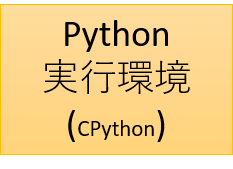
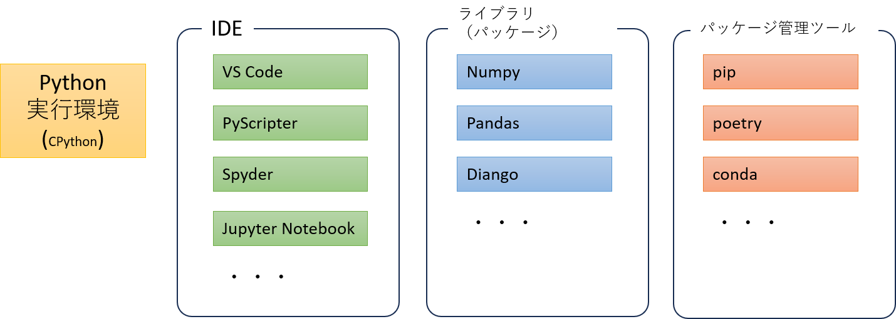
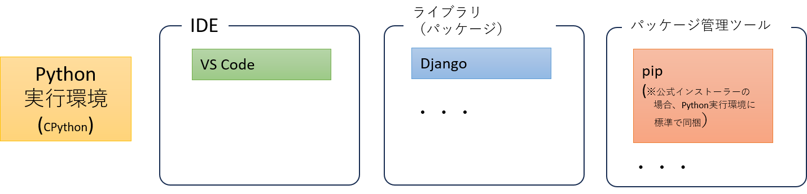
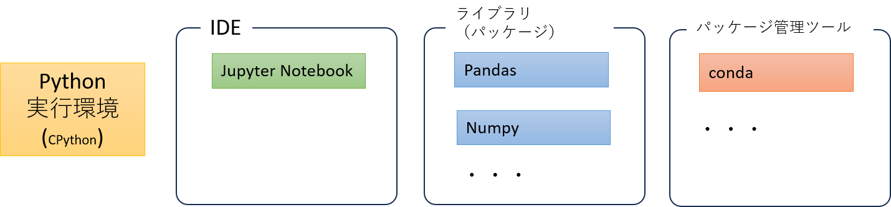
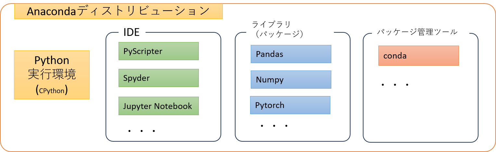

# タイトル

Python公式とAnaconda、Jupter Notebookの関係／違いについて

# 概要

Pythonを学び始める、使い始める場面で考える「Pythonで開発するための環境導入手順」において目にするだろう「Python公式、Anaconda、Jupter Notebook」の3キーワードの関係とそれぞれの違い、を解説する。

<!--
# 目的

概要、に含めて理解できるので省略する。
-->

# 想定読者

* 「Python、Anaconda、Jupter Notebook」の違いについて調べたが、いまいちピンと来なかった方

<!--
# 動作環境（検証環境）
# サンプルコード

実行を伴うものでは無いので省略。
-->

# Pythonの実行環境とは？

「Pythonの実行環境」は「Python言語で書かれたスクリプトを実行できる環境」と言うことができます。
「公式のPython」と言った場合は、Pythonの公式サイトで配布されている、CPythonの事を一般に指します。
CPythonは、Python仕様のリファレンス実装です。
Pythonの公式サイトからインストーラーを取得して実行することで、
Pythonの実行環境を任意のマシン上に導入できます。

このとき、できあがるのは「Python言語で書かれたスクリプトを実行できる環境」だけです。
実際にpython言語であれこれと処理をしたり、処理をするためのアプリケーションを作成するためには、
サードパーティのライブラリを使うことが一般に必要です。
ライブラリの利用の際には、その提供単位であるパッケージを管理するツールもある方が便利です。
もちろんIDE（統合開発環境）もある方が望ましいでしょう。

Pythonで実現したい処理、作成したいアプリケーションに応じて、利用するIEDやライブラリ、パッケージ管理ツールを導入して、「Python開発環境をセットアップ（構築）」します。

Python実行環境の構成例１：

Python実行環境の構成例２：

# Anacondaとは？

用途に応じてPython開発環境を構築するわけですが、例えば
「データサイエンスや科学技術計算であれば、ｘｘｘという組わせが便利で有用である」という一般論があったりします。
そのように用途に応じて組み合わせをひとセット、パックとしてまとめて配布されているものを「ディストリビューション」と呼びます[^1]。

データサイエンスや科学技術計算をPythonを用いて実行するのに有用な一式のセットとして、Pythonの実行環境と合わせていろいろなツールやライブラリなどまとめたディストリビューションが「Anaconda」です[^2]。

[^1]: ITの世界で「ディストリビューション」と呼んだ場合は、たいていは「Linuxディストリビューション」を指します。これは「Linuxカーネルとそれをとりまくソフトウェアセット」を意味します。転じて「コアとなる部分＋それを利用する際に必要なソフトその他のセット」を配布形式にまとめたものをディストリビューションと呼ぶことがあります。

[^2]: "Anaconda® Distribution is a free Python/R data science distribution", https://docs.anaconda.com/free/anaconda/getting-started/what-is-distro/

Python公式のインストーラーを用いて自分で開発環境を構築するか、それともAnacondaディストリビューションを用いて開発環境を構築するか、の分岐は一般に次のようにおすすめされています。[^3]

* プログラミング経験がまったくない人や、いろんな業務の効率化やWebプログラミングなどの一般的なPythonプログラミングを基礎から学びたい、という場合は、公式版のPythonをオススメします
* 汎用的なプログラミングを学ぶのではなく、データサイエンスや機械学習などの学習を目的として、ツールとしてPythonを使うなら、Anacondaをオススメします

[^3]: PythonとAnaconda_ Python環境構築ガイド - python.jp, https://www.python.jp/install/docs/pypi_or_anaconda.html

# Jupter Notebookとは？

https://jupyter.org/

> JupyterLab is the latest web-based interactive development environment for notebooks, code, and data. Its flexible interface allows users to configure and arrange workflows in data science, scientific computing, computational journalism, and machine learning. A modular design invites extensions to expand and enrich functionality.

https://akiblog.tech/?p=511

> Google Colab（正式：Google Colaboratory）
> Jupyter Notebook をベースに Google さんが独自進化させた環境です。

# 参考サイト

* Python環境構築ガイド - python.jp
    * https://www.python.jp/install/install.html

