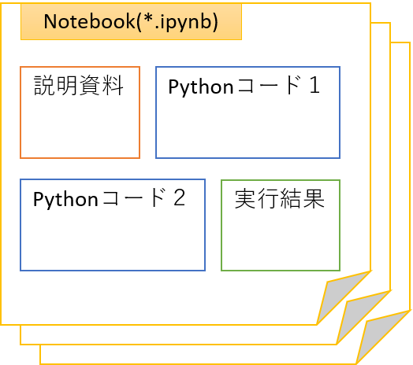

# タイトル

Python公式とAnaconda、Jupter Notebookの関係／違いについて

# 概要

Pythonの学び始めや使い始めの場面で「Pythonで開発するための環境導入手順」として目にするだろう「Python公式、Anaconda、Jupter Notebook」の3キーワードの関係と、それぞれの違い、を解説します。

# TL;DR (TooLong: Didn't Read)
<!-- 使ってみたいので、この表記を使ってみる -->

Python公式のインストーラーで得られるものは、Python実行環境と標準ライブラリを含むセットです。インストール後に利用者の目的に応じて、追加でIDEやパッケージ管理ツール、3rdパーティション製ライブラリの導入を行って、目的に合った開発環境に作り上げていく場面に適します。

Anacondaとは、データサイエンスと科学技術計算での利用向けにライブラリやIDEその他を揃えてセットにしたディストリビューション、のことです。

Jupyter NotebookはIDEの1つであり、単一ファイル内でPythonコードや説明、実行結果まで含めて統合的に扱える形式を特徴とします。Pythonの実行環境を内包し、スタンドアロンでも利用可能ならブラウザーベースのIDEです。

<!--
# 目的

概要、に含めて理解できるので省略する。
-->

# 想定読者

* 「Python、Anaconda、Jupter Notebook」の違いについて調べたが、いまいちピンと来なかった方

<!--
# 動作環境（検証環境）
# サンプルコード

実行を伴うものでは無いので省略。
-->

# Pythonの実行環境とは？

「Pythonの実行環境」は「Python言語で書かれたスクリプトを実行できる環境」と言うことができます。
「公式のPython」と言った場合は、Pythonの公式サイトで配布されている、CPythonの事を一般に指します。
CPythonは、Python仕様のリファレンス実装です。
Pythonの公式サイトからインストーラーを取得して実行することで、
Pythonの実行環境を任意のマシン上に導入できます。

このとき、できあがるのは「Python言語で書かれたスクリプトを実行できる環境」だけです[^1]。
実際にpython言語であれこれと処理をしたり、処理をするためのアプリケーションを作成するためには、サードパーティのライブラリを使うことが一般に必要です。
ライブラリの利用の際には、その提供単位であるパッケージを管理するツールもある方が便利です。もちろんIDE（統合開発環境）もある方が望ましいでしょう。

[^1]: もちろん、標準ライブラリや標準ツールは入ります。しかし基本的な処理ならともかく、大抵の処理を（楽に実行）するには、追加のライブラリや管理ツールを追加することが推奨されます。

Pythonで実現したい処理や作成したいアプリケーションに応じて**追加で**、利用したいIEDやライブラリ、パッケージ管理ツールを導入していき、「Python開発環境をセットアップ（構築）」します。

Python実行環境の構成例１：

Python実行環境の構成例２：

※上記の例はあくまで「目的に応じて適する組み合わせは異なります」を意図しており、この組み合わせを推奨するなどの意図はありません。

# Anacondaとは？

用途に応じたPython開発環境を構築するわけですが、例えば
「データサイエンスや科学技術計算であれば、ｘｘｘという組わせが便利で有用である」という一般論、推奨される組み合わせはあります。
そのように用途に応じて組み合わせをひとセット、パックとしてまとめて配布されているものを「ディストリビューション」と呼びます[^2]。

そのようなパックのうち、「Pythonを用いてデータサイエンスや科学技術計算を実行する」用途で有用なIDEやツール、ライブラリなどをまとめたディストリビューションが「Anaconda」です[^3]。

[^2]: ITの世界で「ディストリビューション」と呼んだ場合は、たいていは「Linuxディストリビューション」を指します。これは「Linuxカーネルとそれをとりまくソフトウェアセット」を意味します。転じて「コアとなる部分＋それを利用する際に必要なソフトその他のセット」を配布形式にまとめたものをディストリビューションと呼ぶことがあります。

[^3]: "Anaconda® Distribution is a free Python/R data science distribution", https://docs.anaconda.com/free/anaconda/getting-started/what-is-distro/

Python公式のインストーラーを用いて自分で開発環境を構築するか、それともAnacondaディストリビューションを用いて開発環境を構築するか、の分岐は一般に次のようにオススメされています。[^4]

* プログラミング経験がまったくない人や、いろんな業務の効率化やWebプログラミングなどの**一般的なPythonプログラミングを基礎から学びたい**、という場合は、公式版のPythonをオススメします
* 汎用的なプログラミングを学ぶのではなく、**データサイエンスや機械学習などの学習を目的**とし、ツールとしてPythonを使うなら、Anacondaをオススメします

[^4]: PythonとAnaconda_ Python環境構築ガイド - python.jp, https://www.python.jp/install/docs/pypi_or_anaconda.html

# Jupter Notebookとは？

Jupyter NotebookはIDEの1つです。そして、他のIDEとは異なる特徴を有しています[^5]。

まず、通常のIDEの機能としては関連ファイルをまとめて管理したり、コード実行を支援する機能などが主です。

[^5]: Jupyter Notebookの後継でありより高機能なJupyterLabを利用さることが昨今では多いですが、本記事ではそれらを纏めて「Jupyter Notebook」と称することとします。

これに対して、Jupyter Notebookは「notebookファイル（*.ipynb）」を用いることで、コードと説明と実行結果などを1つのファイルにまとめて管理する形式を、提供します。
これにより、単なるコードエディターや実行環境だけでなく、ドキュメンテーションや対話的なデータ分析を統合的に扱うことができます。データサイエンスや科学技術計算でJupyter Notebookの人気がある所以です[^6]。

[^6]: 「ブラウザベースのIDEである」こともJupyter Notebookの特徴ではありますが、クラウドIDEとして昨今は他でも提供がある形式です（AWS Cloud9、GitHub Codespacesなど）。どちらか言うと「コード以外も含めて1つのファイルで統合的に扱える」ことがJupyter Notebookの特徴、と私は捉えています（より正確にはJupyterの特徴、ですが、割愛します）。

Pythonの実行環境に対して追加でJupyter Notebookを導入することもできますし、Jupyter Notebook自身にPython実行環境を内包することもできるため、
Python実行環境の無いマシン上で、スタンドアロンのIDEとして実行することもできます。

3つのキーワードの関係と違いの解説は以上です。

# 参考サイト

* Python環境構築ガイド - python.jp
    * https://www.python.jp/install/install.html
* Project Jupyter
    * https://jupyter.org/

