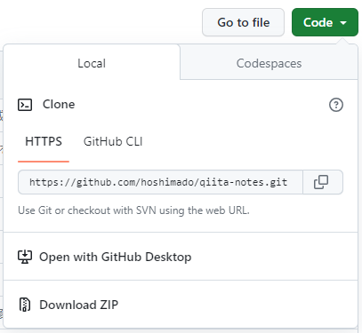
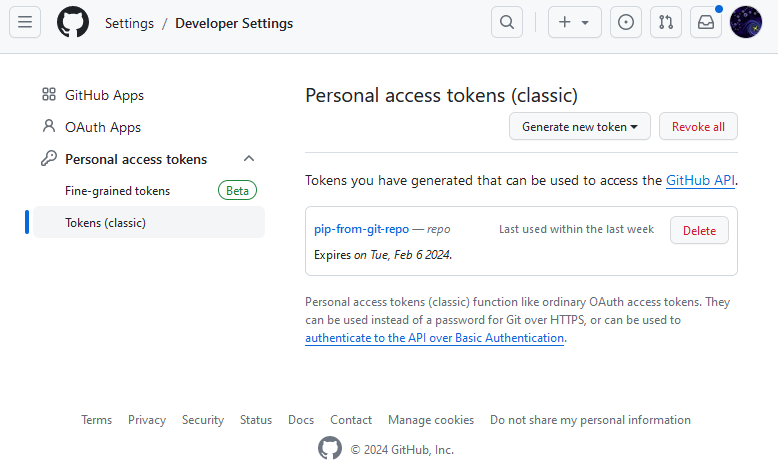
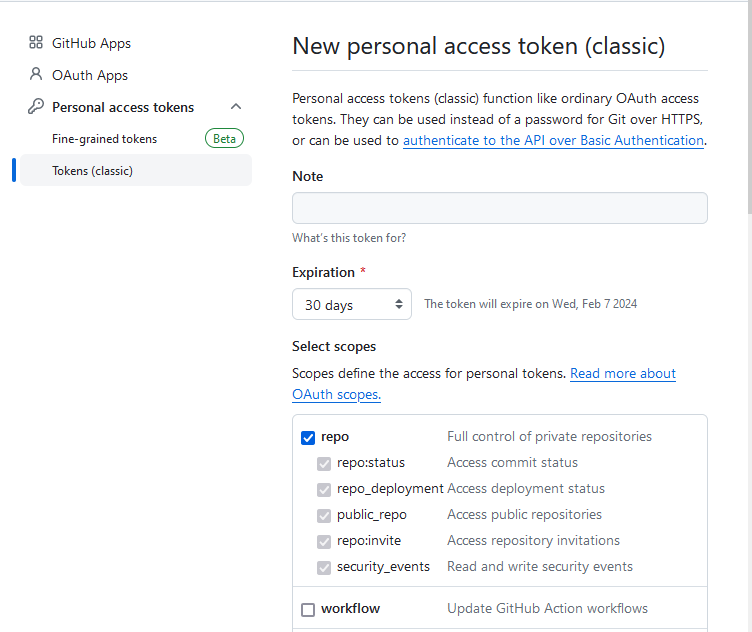
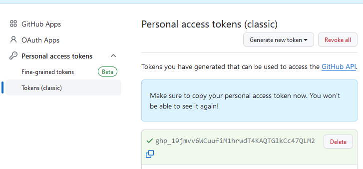
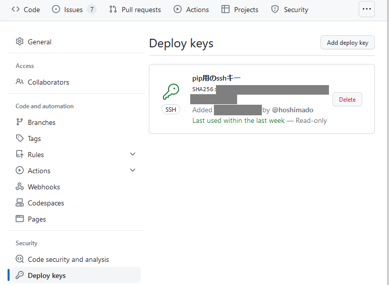
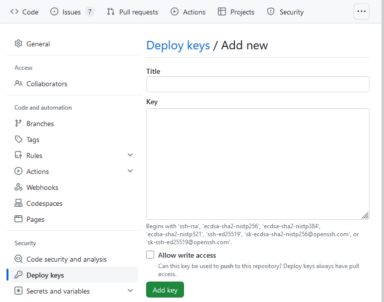
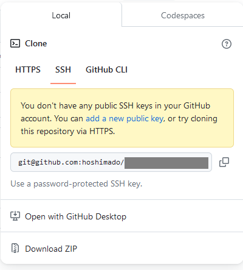

# タイトル

配布パッケージをGitHubリポジトリ経由でインストールする方法（PublicとPrivate両パターン）


# 概要

複数ある「作成した配布パッケージを頒布する方法」の簡単な把握と、
その中でGitHubリポジトリに配置して、そこからpipインストールする方法を解説する。

その際、Publicリポジトリで公開するケースと、Privateリポジトリで公開するケースの2パターンを解説する。


# 目的

PyPIに公開するほどではないが、インターネットを通じある程度広くへ配布パッケージを公開したい場合向けに、
GitHubリポジトリを用いて配布とインストールができるようになることを目的とする。


# 想定読者


# 動作環境（検証環境）


# サンプルコード

稚作の配布パッケージの作成手順の記事、で解説に用いたサンプルコードとリポジトリを用いて説明する。

* 「[Pythonソースコードをパッケージ化する方法（他環境へ配布を目的として）（Setup.py利用）](https://qiita.com/hoshimado/items/7c99e6ef4c9d1bc6bb87)」

なお、以降の記事では上記のサンプルコードを用いるが、「配布方法」は「配布パッケージの作成方法」に依存しない。
したがって、たとえばSetup.pyではなくPoetryを用いた以下の記事で用いたサンプルコードのリポジトリでも
まったく同じことができる。

* 「[Pythonソースコードをパッケージ化する方法（他環境へ配布を目的として）（Poetry利用）](https://qiita.com/hoshimado/items/aa27b3c6287cb279d0ca)」

なお、後述の「pipコマンドによる配布パッケージのインストール」実行時は、
上述の配布パッケージ作成の記事にある「[作成したパッケージの動作確認の方法](https://qiita.com/hoshimado/items/7c99e6ef4c9d1bc6bb87#%E4%BD%9C%E6%88%90%E3%81%97%E3%81%9F%E3%83%91%E3%83%83%E3%82%B1%E3%83%BC%E3%82%B8%E3%81%AE%E5%8B%95%E4%BD%9C%E7%A2%BA%E8%AA%8D%E3%81%AE%E6%96%B9%E6%B3%95)」
と同様に、インストール実行前に仮想環境に入っておくことを推奨する。


# Pythonの配布パッケージの配布方法とインストール方法の種類

配布パッケージ（`*whl`形式とする）のインストールに用いるpipコマンドは、
配布方法に応じた複数のインストール方法をサポートしている。
一般によく使われる配布パッケージの置き場は次の3パターンである。

* PyPIリポジトリ
* GitHubリポジトリ
* ローカルに配布パッケージを直に配置

PyPIは「Python Package Index」の略称であり、pipコマンドにおける公式の配布リポジトリである。

「GitHubリポジトリ」のパターンは、正確にはGitHubである必要はなく、
またGitに限定されず、SubversionなどのいくつかのVCS（=version control systems）リポジトリでも
同様のことが可能。本記事では説明の容易化のためにGitHubで限定して解説する。

ローカルに配布パッケージを置くケースは、もっとも簡単な方法であり、直接配布パッケージを手渡しして
インストール環境に配置し、そこからインストールする方法である。

PyPIを利用する方法はもっとも一般的であり、多数の解説記事があるため、そちらを参照して欲しい。
GitHubリポジトリを利用する方法は、「git cloneしてそこからインストールする操作」をpipコマンドが代行してくれるだけなので
一見簡単に見えるが、pipコマンドの操作でありながらgitコマンドの知識が必要となるため、知らないと手間取りやすい。
最後のローカルからの方法は、配布パッケージファイルを指定すればよいため、特に論ずる点はない。
以上の背景から、上記の3パターンのうち、本記事では「GitHubリポジトリで配布する方法」について、以降で解説する。


# GitHubのPublicリポジトリに配布パッケージを配置する方法とインストール手順

配布パッケージをGitHubのリポジトリに公開して、そこからpipコマンドを用いて
インストールする方法を解説する。
本節ではPublicリポジトリに配置するケースを対象とする
Privateリポジトリに配置するケースでは、配置方法は同じであるがインストール時の
認証に関する設定が追加で必要なる。そちらについては次の節で解説する。

この方式は「リポジトリをgit cloneし、その後にcloneしたリポジトリからパッケージをインストールする」
流れなので、配布パッケージのファイル作成（`*.whl`）はする必要がない。
必要なのは「配布パッケージのファイル作成ができる状態のファイル・フォルダー構成」となる。


## 配布パッケージをリポジトリに格納する方法

配布パッケージを作成するために構成したファイル・フォルダー構造を、そのままGitHubリポジトリに格納する。
より具体的には、リポジトリのルートに`setup.py`もしくは`pyproject.toml`ファイルがある状態を意図する。

サンプルコードであれば、次のようになる。
リポジトリをPublic状態で公開をすれば、配布のための準備は完了。

https://github.com/hoshimado/qiita-notes/tree/main/qiita-python-packagebuild-setuppy/


## GitHubのPublicリポジトリからpipコマンドでインストール方法


GitHubのPublicリポジトリに配置された配布パッケージからpipインストールするために必要な情報は次の通り。

* gitリポジトリのURL

pipコマンドに対して次のようにgitリポジトリのURLを指定して実行する。

```
pip install git+https://[gitリポジトリのURL]
```

ここでgitリポジトリのURLは、以下で表示されるGitHubリポジトリのClone用のURLを指定する。



なお、本サンプルでは先の説明とは異なり、リポジトリのルートでなくサブディレクトリ配下に配置している。
この場合でも、URLフラグメント（アンカー）「`subdirectory`」を用いて対象のサブディレクトリを指定することで、
インストールが可能。
この場合の具体的なコマンドは次の通り。

```
pip install git+https://github.com/hoshimado/qiita-notes.git#subdirectory=qiita-python-packagebuild-setuppy
```

インストール後のパッケージの動作確認は、配布パッケージ作成の手順記事に記載の通りで次のコマンドを実行することで可能。

```
python -m weatherforecast
```

参考までに、mainブランチ以外で配布を行いたい場合（例えばreleaseブランチなどがある場合）は、
ブランチ名も含めて次のように指定することで対応可能。

```
pip install git+https://[gitリポジトリのURL]@[ブランチ名]
```

なお本手順によるインストールは、gitコマンドがある前提で実施可能。
gitコマンドが未導入の環境では、以下のエラーメッセージが表示されて失敗する。

```
ERROR: Error [Errno 2] No such file or directory: 'git' while executing command git version
ERROR: Cannot find command 'git' - do you have 'git' installed and in your PATH?
```


# GitHubのPrivateリポジトリに配布パッケージを配置する方法とインストール手順

Privateリポジトリでも認証情報を設定することで、先の節と同様に
配布パッケージの配布が可能である。
リポジトリへの格納方法はPublicリポジトリと同じなので解説を割愛する。

GitHubでのコマンドラインに対する認証方法はhttpsとsshの2つがある。
それぞれ次のように使い分ける。

* httpsでのPersonal Access Token認証
  * これはGitHubユーザーに紐づく
  * 対象リポジトリにアクセス可能なGitHubユーザーを特定して、配布する場合に適する
* sshでの公開鍵認証
  * これは認証されるサーバーに紐づく（認証す津サーバーでSSHキーペアを発行する）
  * 配布先のサーバー（秘密鍵を保持するマシン）を特定して、配布する場合に適する

なお、上記は「配布する側」の視点で論じている。
このため「配布される側」の視点（取得先のリポジトリが複数あるケース）では
適する方法の異なる場合があるが、今回は割愛する。


## リポジトリに参加しているGitHubユーザーに対して配布する

pipインストールを行うユーザー側で、Personal Access Token（以降、「PAT」と略記）
を発行して、それを含めてpipコマンドを実行する。

PATの発行手順は次の通り。

1. 自身のGitHubユーザー設定画面へ入る
    * https://github.com/settings/profile
2. Developer Settings配下にある「Personal Access Toekns」をクリックする
    * https://github.com/settings/tokens


3. スコープとして「リポジトリへのアクセス」だけを許可（チェック）する


3. 下の方にあるボタン「Generate token」を押下する

次の図のようjにPATが新規作成されるので、文字列（トークン）をコピーする。
ここで、トークンの値を参照できるのはこのタイミングだけなので、
忘れずにコピーすること。
（※下図のアクセストークンは削除済みなので、悪しからず。）




pipコマンドに対して次のように、PATを含めたgitリポジトリのURLを指定して実行する。

```
pip install git+https://[PAT]@[gitリポジトリのURL]
```

これにより、privateリポジトリで公開されている
配布パッケージをインストールすることができる。
サブフォルダーやブランチの場合の指定方法は、
Publicリポジトリの場合と同一。


## リポジトリに紐づけた環境（サーバー）に対して配布する

pipインストールを行うマシン環境（サーバー側）でSSHキーペアを作成し[^1]、
その公開鍵をSSHキーとしてGitHubの対象のprivateリポジトリに
「Deploy Keys」として登録する。

[^1]: 手順としては、「サーバー側である必要はない」が意味付けとしてサーバーを認証するものなので、このように表現する。

SSHキーの作成手順は次の通り。これはWindows 10環境でも実行可能（2018年に配信されたFall Creators Update 1709以降）。


1. コマンドラインを開き、次のコマンドを実行する
```
ssh-keygen -t rsa -b 4096 -C "your_email@example.com"
```
2. コマンドが「`Enter file in which to save the key:`」として保存先を聞いてくるので、SSHキーペアの保存ファイル名を指定（秘密鍵側のファイル名を含めたパスで指定。未入力でEnterキーを押すとデフォルト値が採用される）
3. コマンドが「`Enter passphrase (empty for no passphrase):`」としてパスフレーズを聞いてきたら、未入力でEnterキーを押してSkipする
4. 指定した保存先に、秘密鍵と公開鍵の2ファイルが保存される


作成したSSHキーの公開鍵を「Deploy Keys」に登録する手順は次の通り。

1. 作成した公開鍵（`*.pub`）を任意のテキストエディタ（メモ帳で可）で開く。
2. 対象のprivateリポジトリの設定画面を開く
3. 「Security ＞ Deploy keys】と辿る
    * https://github.com/[リポジトリ名]/settings/keys
4. 「Add Deploy key」ボタンを押す

5. Key欄へ、先ほど開いた公開鍵の内容をまるごと貼り付ける

6. ボタン「Add key」を押して保存する

ここまでで、「Deploy Keys」へのサーバーの登録は環境。

秘密鍵のファイルをpipコマンドの実行フォルダーの直下に
`.ssh/deploy_key`
と言うファイル名で配置するとする。
このとき、登録したサーバー（＝秘密鍵を保有するサーバー）で
pipコマンドを実行する際には次のようにする。

```
set GIT_SSH_COMMAND=ssh -i %CD:\=/%/.ssh/deploy_key
pip install git+ssh://git@[gitリポジトリのURL]
```

上記の「gitリポジトリのURL」は、以下のリポジトリの「SSH」タブに
表示されるURL【ではない】、ことに注意。


Publicリポジトリの場合と同様に「HTTPS」タブのURLを指定する
（具体的には、gitub.comの後がコロンではなく【スラッシュ】になる。つまりユーザー名を指定しているわけ【ではない】）。

ここで「GIT_SSH_COMMAND」は、gitコマンドが参照する環境変数であり、
gitコマンドがssh形式でリモートシステムに接続する必要があるときに、
デフォルトのsshコマンド設定に代わって一時的に優先するコマンド内容を設定する。
これにより、pipコマンドがgit接続する際に利用するsshコマンドに対して、
gitやssh自身の設定ファイルを汚さずに、一時的に必要なsshキーの
秘密鍵を用いて公開鍵認証を行える。


なお、上記の環境変数の設定方法はWindowsでの記法。
Linux環境の場合は、次のようになる。
Linux環境の場合は、秘密鍵ファイルのパーミッションを適切に設定する必要があることに注意。

```
chmod 400 .ssh/deploy_key
export GIT_SSH_COMMAND="ssh -i $(pwd)/.ssh/deploy_key"
```

以上で、privateリポジトリで公開されている
配布パッケージをインストールすることができる。
サブフォルダーやブランチの場合の指定方法は、
Publicリポジトリの場合と同一。


# 参考サイト

* Getting Started - pip documentation
    * https://pip.pypa.io/en/latest/getting-started/
* VCS Support - pip documentation
    * https://pip.pypa.io/en/latest/topics/vcs-support/#supported-vcs
* GitHubへの認証方法について - GitHub Docs
  * https://docs.github.com/ja/authentication/keeping-your-account-and-data-secure/about-authentication-to-github#authenticating-to-the-api-in-a--data-variablesproductprodname_actions--workflow
* デプロイキーの管理 - GitHub Docs
  * https://docs.github.com/ja/authentication/connecting-to-github-with-ssh/managing-deploy-keys
* Git::GIT_SSH_COMMAND - git Documentation
  * https://git-scm.com/docs/git#Documentation/git.txt-codeGITSSHCOMMANDcode


