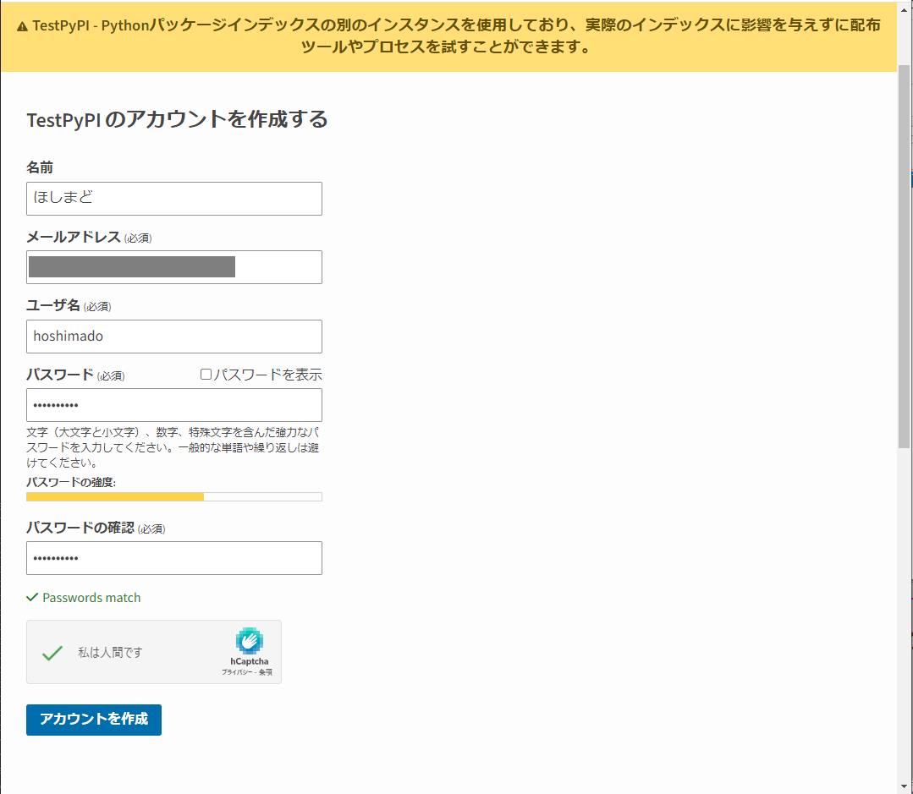
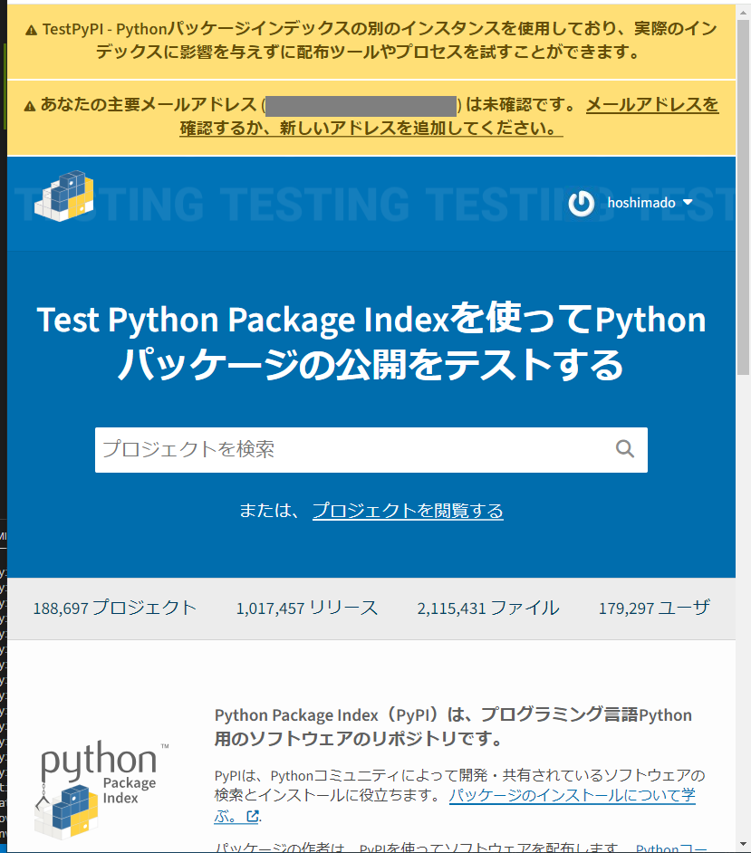
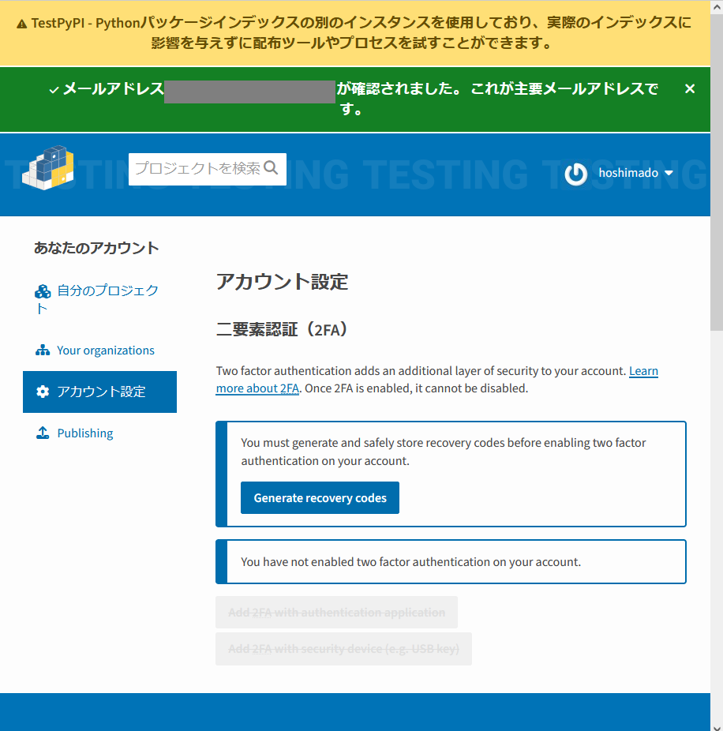
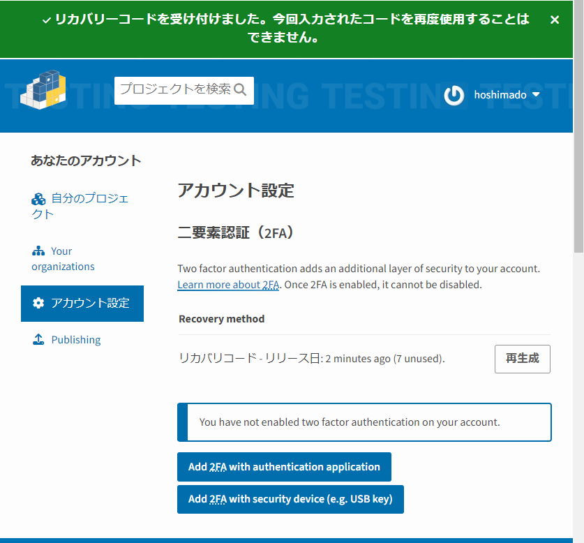
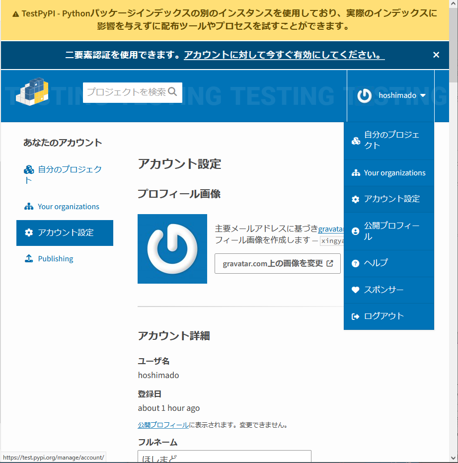
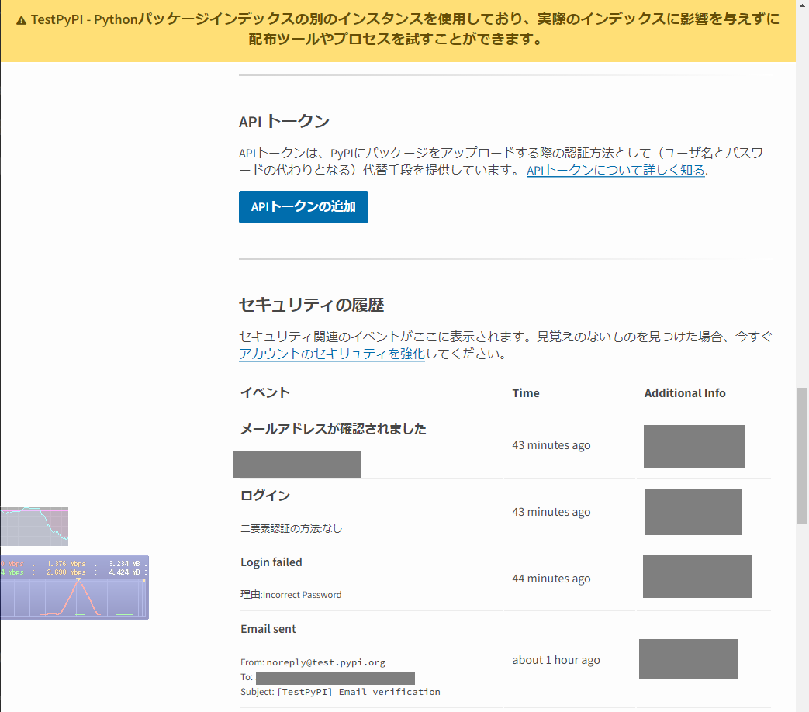
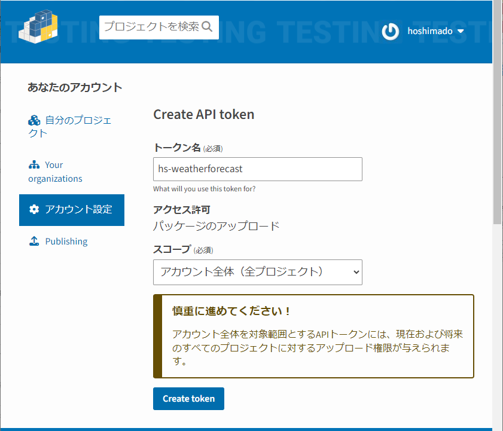

# タイトル

配布パッケージをPyPIで公開してみた


# 概要

PyPI（パイ・ピーアイ）へ、配布パッケージをアップロードして公開するまでの手順。
Python配布パッケージを作り終えたところから開始して、
PyPIにアカウントを作成して配布パッケージを公開するところまでを解説。
解説の粒度は「やってみた」とする。
なお、「やってみた結果、こちらの順序の方が良い」は反映している。

手順としては、以下の記事の続きの位置づけとなる。
Setup.pyを前提としているが、pyproject.tomlでも配布パッケージへの設定部分の読み替えのみで対応可能。

* [Pythonソースコードをパッケージ化する方法（他環境へ配布を目的として）（Setup.py利用）](https://qiita.com/hoshimado/items/7c99e6ef4c9d1bc6bb87)


# 想定読者

ToDo：後で書く
* Pythonコードの開発において、GitHubリポジトリを利用している方
* pipによる配布パッケージの配布に、これから取り組みたい方
* PyPIリポジトリ利用よりも手軽に、もしくは範囲を限定して配布したい方


# 動作環境（検証環境）

次の2つの環境で、サンプルコードの動作確認を実施済み。

* Windows10
    * Python 3.11.5
* WSL2::Ubuntu 22.04.1 LTS
    * dockerイメージ「python:3.9-alpine3.18」


# サンプルコード

検証に用いた配布パッケージのサンプルコードは以下で取得可能。

https://github.com/hoshimado/open-meteo-weather-sample-jpcity

PyPIでの公開リポジトリは以下。

https://pypi.org/project/open-meteo-weather-sample-jpcity/0.0.dev1/


## パッケージ化対象のサンプルコードの仕様

本記事では、PyPIで公開する配布パッケージとして次の仕様のサンプルコードを用いる。

* パッケージの本体は`open_meteo_weather_sample_jpcity`フォルダー
  * フォルダー内のPythonファイル`open_meteo_forecast_api.py`にて、「[Open-Meteo](https://open-meteo.com/)」が提供するWeb APIを利用して指定地点の向こう1週間の1h毎の予想気温を取得する関数「`get()`」を提供する
* 依存関係としてパッケージ「[requests](https://pypi.org/project/requests/)」を必要とする
* `setup.py`が置かれている位置で、コマンド`python setup.py bdist_wheel`を実行すること配布パッケージ（`*.whl`）が作成できるように設定済みである
* 同様jに、コマンド`python setup.py sdist`を実行することで、配布ソースファイルが作成できるように設定済みである

```
+-- requirements.txt
+-- setup.py
|   
\---open_meteo_weather_sample_jpcity/
    +-- open_meteo_forecast_api.py
    +-- __init__.py
    +-- __main__.py        
```

以下、このフォルダー構造を前提に追加ファイルなどを説明していく。


# PyPIで配布パッケージを公開するまで手順

PyPIへ配布パッケージを登録して公開するまでの手順は次の通り[^1]。

1. 配布パッケージを、PyPI公開用に整える（名称や説明文など）
2. PyPIアカウントを作成（初回のみ）
3. PyPIリポジトリへのアクセストークンを作成（アクセス範囲ごとに初回のみ）
4. 配布パッケージをPyPIへアップロードする
5. アップロードした配布パッケージをpipでインストールできることを確認する

[^1]: 公式ガイドの「パッケージングとプロジェクトの配布」で案内されている手順に従う。 - https://packaging.python.org/ja/latest/guides/distributing-packages-using-setuptools/

アップロードコマンドは「`twine`」を用いる。
未インストールの場合は、以下のコマンドで事前にインストールしておく。

```
python -m pip install twine
```


ここで、配布パッケージをPyPI公開用に設定しようとして
「（何らかの理由で）必要な設定ができない」場合はその後のPyPIアカウント作成などは無意味なる。
そのため「公開用の仕様を満たす設定ができるか？」を最初に確認する目的で、
PyPIアカウント作成の前に「整える」工程をするのが妥当と、実際にやってみて思う。

以下、配布パッケージ（`*.whl`）と配布ソースファイル（`*.tar.gz`）の作成が終わっている前提で、上述の手順の詳細を解説する。


## 配布パッケージを、PyPI公開用に整える

本記事では、`setup.py`での配布パッケージ作成を前提にするので、`pyproject.toml`利用時は適宜読み替えのこと（その際は、上述の公式ガイド「パッケージとプロジェクトの配布」の前節に「pyproject.tomlを書く」[^2]があるので、そちらを参照のこと）

[^2]: https://packaging.python.org/ja/latest/guides/writing-pyproject-toml/

PyPIに公開する配布パッケージは最低限、次を満たす必要がある。
満たしていない場合は変更と作成を行う。

* (A) 配布パッケージ名称が、PyPIの名称仕様を満たし且つ重複がないものであること
  * 配布パッケージ名称とパッケージのフォルダー名称は一致していることが望ましいので、このタイミングでパッケージのフォルダー名も必要に応じて変更する
* (B) readmeファイルを含むこと
* (C) ライセンスファイルを含むこと

上記以外（バージョンや依存PKGなど）は、配布パッケージ（`*.whl`）を作成する時点で満たしているはずなので、省略。
なお、バージョンは「PyPIへの登録自体の検証中のバージョン」として「開発中」を位置付ける目的で、次のようにした[^3]。

```
setuptools.setup(
    # 中略
    version="0.0.dev1", # PEP440に従った体系。ここでは「Development release」と位置付ける
```

[^3]: https://packaging.python.org/ja/latest/specifications/version-specifiers/index.html#developmental-releases


### (A) 配布パッケージの名称

配布パッケージの名称が満たすべき仕様は次の通り。

* 英数字、アンダースコア（`_`）、ハイフン（`-`）、ピリオド（`.`）のみからなる
* 始まりの文字は英数字である
* 唯一である事（＝既存の公開済みパッケージ名称と重複しない事）
  * 大文字小文字は区別しない
  * アンダースコア、ハイフン、ピリオドは区別せず、すべてハイフンとして扱う
  * ハイフンが連続した場合は、1つのハイフンとして扱う
  * 完全一致でなくとも誤認し得るような「似た名称」は区別しない
* プロジェクト名が、PyPIの管理者によって明示的に禁止されているものを避けること[^4]

[^4]: https://test.pypi.org/help/#project-name

当方の場合は、当初の配布パッケージの名称を「weatherforecast」としていた。
既存の公開済みパッケージの有無は、PyPIのサイトに対して次のようにURLを打つ事で、
確認できる。

```
https://pypi.org/project/[配布パッケージ名称]/
```

当方の場合は、次のURLを試行して「404」となるので、重複は無し。

```
https://pypi.org/project/weatherforecast/
```

・・・とは、問屋が下ろさない。
後の方で実際にアップロードを行うと、次のエラー「似た名称がある」にヒットして登録できなかった。

```
The name 'weatherforecast' is too similar to an existing project. 
```

これは、既存の配布パッケージとして「weather-forecast」が存在するためであった。
なので配布パッケージ名を「open-meteo-weather-sample-jpcity」に変更した。

※今回、「サンプルであること」と「サンプルの内容が一目瞭然であること」を最優先とし、「なるべく短い方が良い」は諦めた。

なお、登録可能なパッケージ名称か？の検証の仕方は次の記事を参照するのが良い（今回のようなケースは、このパターンでも救えないが）。

* [PyPIにアップロード時のエラー「The name XXX; is too similar to an existing project.」に泣かないために](https://qiita.com/ky5bass/items/2cd18f072eb8cee0775a)

`setup.py`に記載する配布パッケージ名称を変更したら、パッケージフォルダー名も合わせて変更しておく。
注意すべきは、「配布パッケージ名はハイフンが推奨」（アンダースコアなどはハイフンと同一視される）
なのに対して、「パッケージフォルダー名はアンダースコアを用いる」と言う差があること。
なので、`setup.py`での該当部分は次のように記載する。

```
setuptools.setup(
    name="open-meteo-weather-sample-jpcity", # PEP503, PEP508に従いハイフン
    entry_points={
        'console_scripts': [
            'open_meteo_weather_sample_jpcity=open_meteo_weather_sample_jpcity:main',
            # PEP8に従いアンダースコア
        ],
    },
```


### (B) readmeファイルを含むこと

配布パッケージが「どういうものか？」を記載したファイルを作成する。
このファイルはPyPIのページに表示される内容となる。
作成せずともPyPIへの登録は可能だが、無しだと「（パッケージについての）説明はありません」表示になるので、
概ね必須で作成すべきだろう。
ファイル形式はいくつかサポートされているが、当方が慣れ親しんでいるmdファイルを採用する。

作成したREADME.mdファイルからテキスト文字列を読み込み、次のように`setup()`の引数`long_description`へ渡す。

```
from pathlib import Path
this_directory = Path(__file__).parent
long_description = (this_directory / "README.md").read_text(encoding="utf-8")

setuptools.setup(
    # ～中略～
    long_description=long_description,
    long_description_content_type='text/markdown',
```


### (C) ライセンスファイルを含むこと

配布パッケージのライセンスを記載したファイルを作成して`LICENSE.txt`のファイル名で格納する。
今回の例でMITライセンスとしているので、
GitHubリポジトリ作成時に生成したMITライセンスファイルをコピーして
`LICENSE.txt`のファイル名にリネームして`setup.py`と同じ位置に格納する。


## PyPIアカウントを作成（初回のみ）

PyPIのアカウント作成する。
なお、試行用としてTestPyPIリポジトリが用意されているので、
最初はTestPyPIにアカウントを作成してアップロードまで実施確認を行うのが良いかもしれない。

PyPIとTestPyPIは、アカウント作成手順とその後の公開手順も含めて、
**公開先リポジトリのみが異なり**、それ以外は同一。

アカウント作成に必要な入力情報は次の通り。

* メールアドレス
* パスワード
* ユーザー名

なお、アカウント作成後に2FA認証も設定する必要があるため、追加で以下の準備が必要。

* TOTPアプリケーション

TOTPアプリケーションの具体的な選択肢としては、
Google AuthenticatorやMicrosoft Authenticatorなど。
当方はすでに利用中であったMicrosoft Authenticatorアプリを用いた。


PyPIサイトにある以下の登録フォームから登録することで、アカウントを作成できる。

https://pypi.org/account/register/

TestPyPIの場合は、登録フォームは以下。

https://test.pypi.org/account/register/

（以下のスクショはTestPyPIでのもの）




アカウントを作成したら「メールアドレスが有効であること」を確認しておく。
具体的には、登録に用いたメールアドレスへメールが届いているので、
そのメール内にある確認用のURLをクリックすることで実施する。

続いて、2FA認証を設定する（しておかないと、この後のAPIトークン作成で弾かれる）。
PyPIにログインした状態で「アカウント設定＞二要素認証」と辿り、
先ずは「Generate recovery codes」ボタンを押下する。
生成されたリカバリーコードを保存する。



リカバリーコードを作成すると、
その下部にあるボタン「Add 2FA with authentication application」が
有効になるので、そのボタンを押す。



リカバリーコードを1つ入力要求された後、
TOTPアプリケーション用のQRコードが表示される。
任意のTOTPアプリケーションで読み取り、
そのTOTPアプリケーションをPyPI（もしくはTestPyPI）の2FA認証のデバイスとして登録する。
これで、2FAの有効化は完了。


## PyPIへのアクセストークンを作成（アクセス範囲毎に初回のみ）

PyPIへの配布パッケージファイルのアップロード時に用いるAPIトークンを作成する。



PyPIにログインした状態で「アカウント設定＞APIトークン」と辿り、
「APIトークンの追加」ボタンを押下する。



APIトークンが作成されるので、任意の場所に記録する。
これはこの後の配布パッケージのアップロード時に入力が必要となる。
この作成時しか参照できないので、忘れずにメモすること。
（忘れた場合は、新たにAPIトークンを作成する）

なお、APIトークン作成時の「スコープ」は
配布パッケージを公開後に、選択ができるようになる（ぇ）。
2回目以降にAPIトークンを作成する時に絞り込む用途かな？




## 配布パッケージをアップロードする

PyPIリポジトリへ配布パッケージをアップロードするには、`twine`コマンドを利用する。
配布パッケージを作成したフォルダー（`setup.py`のあるフォルダー）に移動し、
次のコマンドで配布パッケージとソース配布パッケージの作成を行う。

```
python setup.py bdist_wheel
python setup.py sdist
```

この操作により、前半の節で設定した配布パッケージ名称、バージョン、README、ライセンスを
反映した配布パッケージファイルが作成される（`dist`フォルダーが作成されて、その配下に出力される）。

`dist`フォルダー配下に配布パッケージがある状態で、次のコマンドを実行する。

```
twine upload dist/*
```

アップロード先がTestPyPIの場合は次のコマンドに代える。

```
twine upload --repository testpypi dist/*
```

するとusernameとパスワードの入力を求められるので、それぞれ次のように入力する。
PyPIアカウントのユーザー名とパスワード【ではない】ので注意。

* username: `__token__`
* password: `[先の節で作成したAPIトークン]`

次のように表示されたら、アップロード成功。
「`View at:`」で示されたURLをこの後のインストール確認で使うのでメモしておく。

```
Uploading distributions to https://test.pypi.org/legacy/
Uploading XXX.whl
100% ━━━━━━━━━━━━━━━━━━━━━━━━━━━━━━━━━━━━━━━━ 7.4/7.4 kB 00:00 
Uploading XXX.tar.gz
100% ━━━━━━━━━━━━━━━━━━━━━━━━━━━━━━━━━━━━━━━━ 6.6/6.6 kB 00:00

View at:
https://test.pypi.org/project/XXX/M.M.R/
```

なお、毎回にusernameとパスワードを入力するのが面倒な場合は、
`.pypirc`ファイルにAPIトークンを設定することで毎回の入力を省略できる[^4]。

[^4]: https://packaging.python.org/ja/latest/specifications/pypirc/


## インストールを確認する

PyPIにアップロードした配布パッケージからインストールができるか？を確認する。
前の節で確認した「`View at:`」に表示されたURLをブラウザーで開く。
このページが、配布パッケージのPyPIでの公開ページとなる。
冒頭にインストールコマンドが記載されているので、そちらにしたがいインストールを行い、
成功したら確認は完了。

なお、TestPyPIの場合は依存パッケージ側の取得に失敗する
（テスト用のリポジトリであり、通常のPyPIと同様のパッケージが存在するとは限らないため）
場合があることに注意。

また、次のようなエラーメッセージが出ることがあるが、
これはリポジトリ側への配布パッケージの反映が追い付いていないだけなので、
時間を空けて（数分後に）再試行すると解消する。

```
Looking in indexes: https://test.pypi.org/simple/
ERROR: Could not find a version that satisfies the requirement XXX==M.m.r (from versions: )
ERROR: No matching distribution found for XXX==M.m.r
```


# 参考サイト

* Getting Started - pip documentation
    * https://pip.pypa.io/en/latest/getting-started/
* VCS Support - pip documentation
    * https://pip.pypa.io/en/latest/topics/vcs-support/#supported-vcs
* GitHubへの認証方法について - GitHub Docs
  * https://docs.github.com/ja/authentication/keeping-your-account-and-data-secure/about-authentication-to-github#authenticating-to-the-api-in-a--data-variablesproductprodname_actions--workflow
* デプロイキーの管理 - GitHub Docs
  * https://docs.github.com/ja/authentication/connecting-to-github-with-ssh/managing-deploy-keys
* Git::GIT_SSH_COMMAND - git Documentation
  * https://git-scm.com/docs/git#Documentation/git.txt-codeGITSSHCOMMANDcode


