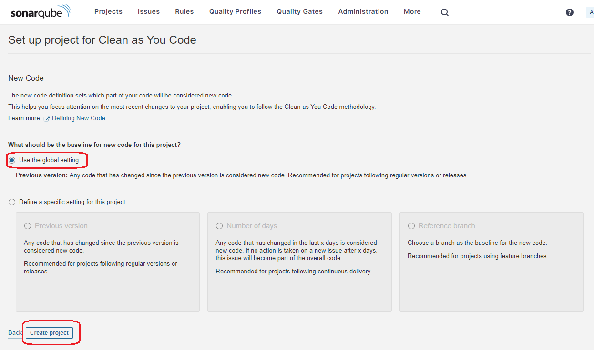
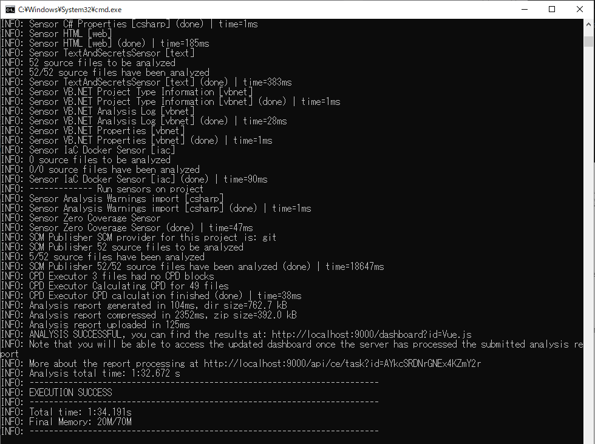

# sonarqube-docker-windows

タイトル
    
* Windows上でDocker越しSonarQubeを起動して、ローカルソースをコード検証する


# 概要

Windows環境で、Dockerイメージを用いて簡単にSonarQubeサーバーを起動して、
ローカルのソースのコード検証を行う方法を説明する。

今回の検証対象のコードはNode.js（JavaScript / Vue.js）とする。


## 目的

SonarQubeによるコード検証を、Windowsのローカル環境で簡単に試すことを目的とする[^1]。
SonarQubeサーバーの起動には**Docker版**を用いるものとする。
Docker Desktop for Windows WSLバックエンドをインストール済みの環境、を前提とする。

Dockerを用いる理由は、「SonarQubeサーバーの**Zip版**を取得して起動する方式」でも手順自体は簡単だが[^2]、
一方でその公式ガイドを見に行くと「`Download and install Java 17 on your system.`」の記載があり[^3]、
Java 17と既存環境との整合を考慮するのが面倒だったため（2023-07-04時点）。

[^1]: 公式が、ローカル インスタンスをインストールしてすぐに起動して実行できる、SonarQubeを直接体験するための方法、を提供してくれている。 https://docs.sonarsource.com/sonarqube/latest/try-out-sonarqube/

[^2]: 参考までに、From the zip file版を用いた実施例の記事はこちら。https://qiita.com/omix222/items/42479f14ba50f9f6f69b

[^3]: 公式ガイドの「`From the zip file`」で案内のある手順に記載あり。 https://docs.sonarsource.com/sonarqube/latest/try-out-sonarqube/#installing-a-local-instance-of-sonarqube


## サンプルコード

次の通り（[本リポジトリー](./)に格納と、公式サイトへのリンク）。

* [docker-compose.yml](./docker-compose.yml)
  * 本記事で利用するDocker Composeファイル
* [sonar-scanner-cli-4.8.0.2856-windows.zip](https://binaries.sonarsource.com/Distribution/sonar-scanner-cli/sonar-scanner-cli-4.8.0.2856-windows.zip)
  * 本記事の作成時点（2023-07-09）での、SonarScannerモジュールへの直リンク
    * 上位階層は[こちら](https://docs.sonarsource.com/sonarqube/latest/analyzing-source-code/scanners/sonarscanner/)
  * 本記事では、Cloneしたリポジトリ直下にフォルダー「`sonar-scanner-cli`」を作成して、その配下へ上記のZipファイルを展開し、「`sonar-scanner-cli\bin\*`」となるように配置する手順で案内する


## 想定読者

* SonarQubeでのコード検証に興味はあるが、未だ検証を実行したことがない方
* 利用可能なSonarQubeサーバーは手元になく、とりあえずの試行用にローカルでSonarQubeサーバーを建てたい方
* Windows上で試行したい方


## 動作環境（検証環境）

* OS：Windows 10 Pro, 22H2
* メモリー：16GByte
* Docker Desktop for Windows WSLバックエンド v.4.16.3
  * WSL2へのメモリー上限設定：3GByte


# 前準備

WSL2のメモリ使用量を制限している場合は[^3]、3GB程度[^4]まで上限を緩和しておくこと。
筆者は3GBで試行。
なお、メモリ1GBに制限している場合は、SonarQubeサーバー起動時にやたらと
ディスクアクセスが発生し（おそらくSwap）、10分経っても起動したなっかったので要注意。

[^3]: `%UserProfile%\.wslconfig`（`C:\User\[UserName]\.wslconfg`）ファイルを作成して、「`memory=3GB`」などで設定できる。https://dev.classmethod.jp/articles/learn_wsl2_wslconfig/

[^4]: 一応の根拠としては「SonarQube自身用に2GB、OS用に空きメモリーが1GBある想定」と動作要件に書かれていること。 https://docs.sonarsource.com/sonarqube/latest/requirements/prerequisites-and-overview/#hardware-requirements


# SonarQubeサーバーの起動

任意のディレクトリに以下のdocker-composeファイルを格納する。

* [docker-compose.yml](./docker-compose.yml)

このファイルは、以下のSonarQube公式のリポジトリでサンプルとして公開されているファイル、に次の変更を加えてある。

1. 追加でコンテナー名「`sonarqube`」を設定
2. Dockerイメージのバージョンとして現時点（2023-07-09）のCommunity版の「`latest`」である「`10.1.0-community`」を明示的に指定[^5]

* SonarQube公式のリポジトリにあるサンプル
  * https://github.com/SonarSource/docker-sonarqube/tree/master/example-compose-files/sq-with-h2

[^5]: https://hub.docker.com/_/sonarqube


サンプルファイルの詳細は、同リポジトリ内の以下のページを参照。

https://github.com/SonarSource/docker-sonarqube/blob/master/examples.md

ファイルの内容は次の通り（[付録](#付録)に、内容の解説を記載）。

```yml:docker-compose.yml
version: "3"
services:
  sonarqube:
    image: sonarqube:10.1.0-community
    container_name: sonarqube
    volumes:
      - sonarqube_data:/opt/sonarqube/data
      - sonarqube_extensions:/opt/sonarqube/extensions
      - sonarqube_logs:/opt/sonarqube/logs
    ports:
      - "9000:9000"
    init: true
volumes:
  sonarqube_data:
  sonarqube_extensions:
  sonarqube_logs:
```

上記のファイルを格納したディレクトリで、次のコマンドを実行してDockerコンテナーを起動する。

```
docker-compose up -d
```

起動したら、ブラウザーで次のURLへアクセスする。

```
http://localhost:9000/
```

初回は、起動完了まで時間がかかるかもしれないので（～1分くらい）、その場合は少し待つ。
次のログイン画面が表示されたら、SonarQubeサーバーへのアクセスは成功。起動は完了している。


User名とパスワードを入力してログインする。初期値は共に「`admin`」。

初回ログインすると、パスワード変更を求められるので、任意のパスワードに変更しておく。
なお、パスワード等のデータを保存するためのDockerボリュームをcomposeファイルで
設定して起動しているので、ここで設定した値は永続して保持されることに注意（Dockerボリュームを削除すれば消える）。


# SonarQubeプロジェクトの作成（検証対象の識別用）

SonarQubeにおいて、コード検証の実施対象は「プロジェクト」という単位で管理される。
初回ログイン時を含めて「プロジェクト」を未作成の場合は、次のようなプロジェクト作成画面が表示される。

下段に表示されている「Manually」を選択する
（上段は、連携機能が提供されているリポジトリのCIツールと組み合わせる場合に選択する。Commitで変更された部分のみを検証する等の使い方が、できるようになる）。


任意のプロジェクト名称とプロジェクトキーを入力する。
プロジェクトキーはプロジェクトを識別するためのIDであり、SonarQubeのダッシュボードで検証結果を確認する際のURLの一部となる（URLクエリーに使用される）。

ブランチは、今回は構成管理には接続しないので意味を持たない。
デフォルトのまま「`main`」を設定する。
「Next」ボタンを押す。


続いて「何を新しく追加されたコードとみなすか？」の設定を問われるので、
「`User the global setting`」を選択して、下部の「Create project」ボタンを押す。
（構成管理でのCommit毎にどう品質が変わったか？の検証のためであり、今回は意味を持たない）



以上で、SonarQubeプロジェクトの設定は完了。
続く画面では、検証対象のコードの設定に進む。


# 検証対象に対するSonarScannerの配置と設定

コード検証を実行する対象のコードを設定するには、
最初に「コード検証の実行をトリガーする方法」から設定する。
これは、一般に何らかのCIツールから自動実行でコード検証がトリガーされるように構成することが多いため。
今回は、CIツールを用いずローカルで試験的にコード検証を実行するため、下段の「`Locally`」を選択する。


コード検証は、
「検証対象のソースが配置されたマシンのフォルダー内でSonarScannerを実行し、検証結果をSonarQubeサーバーへ送付する」
という流れで行われる[^6]。
この目的のために、先ずはSonarScannerからSonarQubeサーバーへ接続するためのトークンを生成する。ここは、デフォルトのままで「`Generate`」ボタンを押す。


[^6]: コード検証自体はSonarScannerと呼称されるモジュールで行われる。コードの品質（どのソースコードに問題が多いか？Commitによってどう品質が推移したか？等）を扱うには、コード検証の結果を「分析」して「管理」する必要があり、その「分析」と「管理」を行うのがSonarQubeサーバーとなる。なおSonarScannerでの検証時に検証の閾値などのSonarQubeサーバーから取得しているらしく、SonarScannerを単独利用する方法は見つからず。


「`Provide a token`」の画面で、生成されたトークンが表示される。
「`Continue`」ボタンを押して次へ進む。
（次の画面で、このトークンを含めて必要な情報が改めて提示されるので、ここではトークンの値をコピーしなくても良い）。

SonarScannerモジュールを準備する。
画面にしたがって検証対象のコードのBuildプラットフォームとOSを選択する。
今回の対象は「Node.js」なので「`Other`」を選択する。
OSは「`Windows`」を選択する。
利用すべきSonarScannerモジュールへのリンクが表示されるので、
「`official documentation of the Scanner`」から
指定先のWebページへジャンプし、「`Windows 64-bit`」を選択してダウンロードして任意の場所に保存しておく。
「`Execute the Scanner`」の欄に表示されている実行コマンドが、「SonarScannerを実行するためのコマンド」になるので、これをコピーしておく。ここに、先ほど生成した「トークン」の値も含まれている。
（なお当然ながら、トークンの値は作成した環境でのみ有効）。


ダウンロードしたSonarScannerのZip（本記事の作成時点では `sonar-scanner-cli-4.8.0.2856-windows.zip`）を展開して任意の位置に格納する。
ガイドでは「`%PATH%`」配下に展開後の`bin`フォルダーを格納するように案内があるが、これは`bin`フォルダーへのパスを毎回指定するのを簡略化する事が目的。今回は試行なので、Docker Composeファイルを置いたフォルダー配下にフォルダー「`sonar-scanner-cli`」を作成して、その配下へこのZipファイルを展開し、「`sonar-scanner-cli\bin\*`」となるように配置するものとする。

```
./docker-compose.yml
./sonar-scanner-cli
    ├─bin
    ├─conf
    ├─jre
    └─lib
```

以上で、SonarScannerの配置と設定は完了。
続いて、先ほどコピーしてメモした「SonarScannerを実行するためのコマンド」を用いて、実際にコード検証の実行へ進む。


# SonarQubeによるコード検証の実施

コード検証を行うには、検証対象のソースファイルが置かれているフォルダー位置のルートでSonarQubeを実行する。

具体的には、たとえば検証対象のNode.jsのVue.jsプロジェクトのソースファイルのルートディレクトリが「`C:\GitHubRepo\vue-application\src`」であれば、この`src`フォルダー直下でコマンドラインを開く。その位置で、先ほどコピーしてメモした「SonarScannerを実行するためのコマンド」を、先ほど格納した「<`sonar-scanner-cli`へのフォルダパス>`\bin\sonar-scanner.bat`」に対して実行する[^7]。

[^7]: 「`Run the following command from the project base directory to launch analysis`」, https://docs.sonarsource.com/sonarqube/latest/analyzing-source-code/scanners/sonarscanner/#running-from-zip-file

たとえば、先ほどのSonarScannerを格納したフォルダーが「`C:\GitHubRepo\sonarqube-docker-windows`」だと仮定すると、
具体的なコマンド例は、次のようになる[^8]。

```
C:\GitHubRepo\sonarqube-docker-windows\sonar-scanner-cli\bin\sonar-scanner.bat -D"sonar.projectKey=Vue.js" -D"sonar.sources=." -D"sonar.host.url=http://localhost:9000" -D"sonar.token=sqp_32f5505e18324a1a9ba00aa0f25d4574abe33908"
```

[^8]: 実際の運用ではScanner用の設定ファイル（`sonar-project.properties`）を作成してプロジェクト名やコード検証対象のディレクトリ等を指定する。ここでは容易化のためコマンドの引数で直接に設定渡す「`-D`」オプションを用いている。 https://docs.sonarsource.com/sonarqube/latest/analyzing-source-code/scanners/sonarscanner/#configuring-your-project, https://docs.sonarsource.com/sonarqube/latest/analyzing-source-code/analysis-parameters/

実行すると、次のようにコード検証が進む。


途中でJavaによる外部通信を求めるダイアログがポップアップした場合は、「キャンセル」して問題ない。


しばらくすると（当方の環境では1分くらい）、次のように表示される。これでコード検証は完了。検証結果の確認に進む。




## コード検証を行うソースがGit管理対象の場合の推奨設定

SonarScannerの実行ログを格納するフォルダー「`.scannerwork`」が、コード検証を実行した先のフォルダーに作成される。
これは一時フォルダーなので、`.gitignore`ファイルに指定して除外しておくことが望ましい。

なお、筆者は以下の設定を`.gitignore`ファイルに記載して実施した。

```
# ----------------------------------------------------------------
# Created by https://www.toptal.com/developers/gitignore/api/sonarqube
# Edit at https://www.toptal.com/developers/gitignore?templates=sonarqube

### SonarQube ###
# SonarQube ignore files.
#
# https://docs.sonarqube.org/display/SCAN/Analyzing+with+SonarQube+Scanner
# Sonar Scanner working directories
.sonar/
.sonarqube/
.scannerwork/

# http://www.sonarlint.org/commandline/
# SonarLint working directories, configuration files (including credentials)
.sonarlint/

# End of https://www.toptal.com/developers/gitignore/api/sonarqube
```


# コード検証結果の確認

SonarQubeサーバーに戻る（ブラウザーで「`http://localhost:9000/`」を開く）。すると次のようにプロジェクト一覧が表示される。「`Vue.js`」の名前のプロジェクトが今回に作成したプロジェクトなので、この名前の部分をクリックする。


コード検証結果の概要表示ページに遷移する。
なお、SonarQubeサーバーでプロジェクトの設定画面を開いたままだった場合は（SonarScannerの設定画面のところ）、自動的にこちらの画面へ遷移している。


「Bugs」等の先でコード検証結果の詳細を確認できる。

参考までに、筆者の環境でのコード検証の実施結果を掲載すると、次のような指摘を確認できた。


# SonarQubeサーバーの終了処理

起動しているSonarQubeサーバーを停止するには、以下のコマンドを実行する（通常のDockerコマンド操作と同じ）。

```
docker-compose down 
```


# 付録

## 利用したComposeファイルの内容

SonarQubeサーバーのDockerコンテナー起動に利用したDocker Composeファイルの内容を、簡単に記載する。
なお内容としては概ね、先に示した取得元の次のページに書いてある通りである。

https://github.com/SonarSource/docker-sonarqube/blob/master/examples.md

* Dockerコンテナー作成の元となるDockerイメージにSonarQubeコミュニティ版を指定
* コンテナーのボリュームを作成して、次の内容を永続的に保持するよう設定
  * SonarQubeが使用するデータ：`/opt/sonarqube/data`
  * 拡張機能のデータ：`/opt/sonarqube/extensions`
  * ログの保存先：`/opt/sonarqube/logs`
* ホストのポート9000をコンテナーのポート9000にマッピング
* initオプションを使用してSonarQubeサーバーの初期化プロセスを有効化
* 今回は試行なので、外部データベースは指定しない（したがって、組み込み版の内部DBを利用する）[^9]
  * 外部データベースを利用する場合は `sonar.jdbc.*` プロパティに指定する（今回はしない）[^10]

[^9]: `The embedded H2 database is used by default. It is recommended for tests but not for production use.`, https://docs.sonarsource.com/sonarqube/latest/setup-and-upgrade/configure-and-operate-a-server/environment-variables/#database

[^10]: https://docs.sonarsource.com/sonarqube/latest/setup-and-upgrade/install-the-server/#installing-the-database


# 参考サイト

* 【SonarQube】Docker Composeでサクッと試してみる _ amateur engineer's blog
    * https://amateur-engineer-blog.com/sonarqube-docker-compose/

* SonarQube はじめの一歩 – SAT Staff Blog
    * https://blog.sat.ne.jp/2020/08/03/sonarqube/

* DockerでSonarQubeを構築してPythonコードを解析する
    * https://zenn.dev/whitecat_22/articles/5affdcb053c860#5-sonar-scanner%E3%81%AE%E3%82%A4%E3%83%B3%E3%82%B9%E3%83%88%E3%83%BC%E3%83%AB

* SonarQube Documentation
    * https://docs.sonarsource.com/sonarqube/latest/


