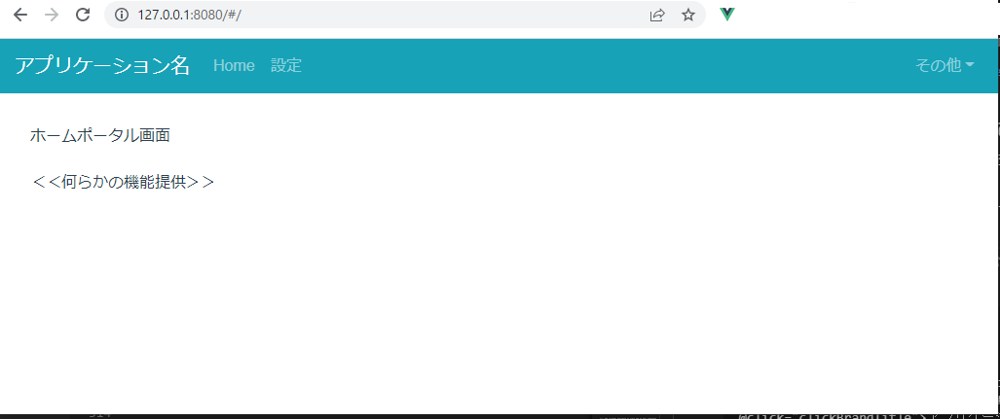
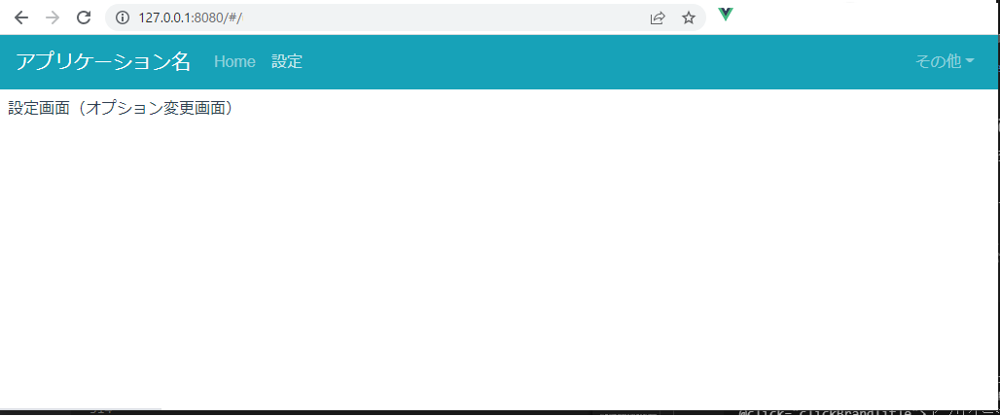
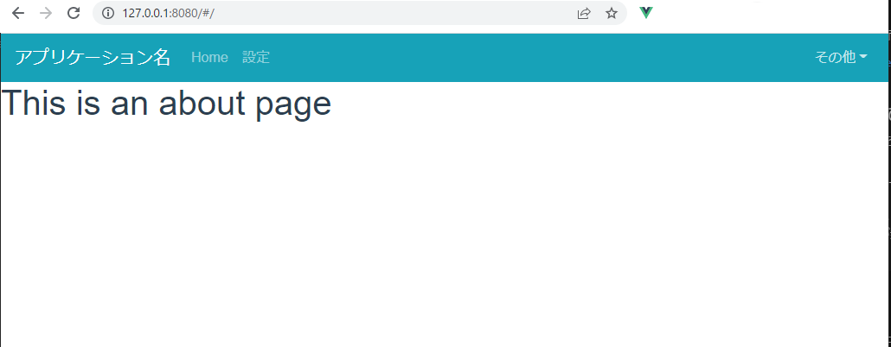

# 概要


Vue.js のRouter機能について、以下の観点で説明する。

* divタグ単位での`v-if / v-show`ディレクティブでの表示切り替えから、Router機能を用いた表示切替へ移行する
    * `vue create` 時に「Router」を選択するだけ、Router機能による切り替えのサンプルコード（Demo）が生成されるが、敢えて上述の比較でとらえる
* 【これは別記事に。いったん区切るべきかと】Routerで切り替えたページへのデータの渡し方（※「`prop`」でも渡す方法もあるので）について、Vuexを用いる方法を説明する


## 動作環境（検証環境）

* BootStrap（BootStrap-Vue）を使いたい都合で、Vue.jsはV.2.x系とする

```package.json
  "dependencies": {
    "bootstrap-vue": "^2.22.0",
    "core-js": "^3.8.3",
    "vue": "^2.6.14",
    "vue-router": "^3.5.1",
    "vuex": "^3.6.2"
  },
```


# 作成手順

## Vue.jsのCLIでの動作環境の構築

作成済みの人は、本節はSkipして構わない。

なお、Vue.jsのビルド済みファイルの表示にはhtppサーバーが
必須なので、ローカル環境での簡易確認を目的に
「`http-server`」をインストールしておく。

```
npm init
npm i http-server --save-dev 
npm i @vue/cli  --save-dev 
```

`npm init` での質問項目は好きなように。
特にこだわり名が無ければ「`npm init -y`」として、
全てデフォルトで作成、でも良い。


## Vue-CLIによるプロジェクト作成を、Router有効状態で実施

Vueコマンドで、Vue-cliプロジェクトを作成。

なお、作成済みのプロジェクト一式を
[vue-router-if-show.zip](./vue-router-if-show.zip)
に置いているので、このZipをダウンロードして、
展開後のフォルダ内で、「`npm install`」しても良い。

以下は、vueコマンドを用いてゼロから作成する場合の手順。
ここではプロジェクト名称を「cli-vue」とする。


```
npx vue   create cli-vue
```

プロジェクトの設定値は以下の通り。
後のことを考慮して、Routerの他に、Vuexも選択しておく。
（なお、`Vuex`は本記事の範囲で利用しない）

```
Vue CLI v5.0.4
? Please pick a preset:
  hoshimado-defualt-vuejs ([Vue 2] babel, eslint, unit-mocha) 
  Default ([Vue 3] babel, eslint)
  Default ([Vue 2] babel, eslint)
> Manually select features
```

```
? Please pick a preset: Manually select features
? Check the features needed for your project: Babel, Router, Vuex, Linter, Unit
? Choose a version of Vue.js that you want to start the project with 2.x
? Use history mode for router? (Requires proper server setup for index fallback in production) No
? Pick a linter / formatter config: Basic
? Pick additional lint features: Lint on save   
? Pick a unit testing solution: Mocha
? Where do you prefer placing config for Babel, ESLint, etc.? In dedicated config files
? Save this as a preset for future projects? (y/N)
```

Vue-CLIのプロジェクト作成が完了したら、そのルートに
「`vue.config.js`」ファイルを作成して（既にある場合は修正）、
次のように記述する。

これにより、Vue-CLIのプロジェクトフォルダである「cli-vue」と
同じフォルダ階層に「public」フォルダが生成され、
Vue-CLIのプロダクションBuild時には、そちらへ出力されるようになる。
この「public」フォルダーが、先にインストールした
簡易HTTPサーバー「`http-server`」の表示対象フォルダとなる。

```vue.config.js
const { defineConfig } = require('@vue/cli-service')
module.exports = defineConfig({
  publicPath: './',
  outputDir : '../public',
  transpileDependencies: true
})
```


続いて、BootStrap-Vueをインストールする。
具体的には次コマンドを実行。

```
npm i bootstrap-vue --save 
```

BootStrap-Vueのインストールを終えたら、Vue.jsの
「`main.js`」ファイルを開いて、既存の`import`記述に続けて、
以下を追記する。

```main.js
// +++ add for bootstrap +++
import 'bootstrap/dist/css/bootstrap.css'
import 'bootstrap-vue/dist/bootstrap-vue.css'
// -------------------------
```


この状態で`npm run serve`コマンドを実行すると、
デフォルトのVue-CLIでのRouterサンプルファイルの
表示確認が出来るが、今回は敢えてしない。

※デフォルトのサンプルファイルについては、Vue.jsの公式ページのガイドに記載があるので、そちらを参照。

* ルーティング — Vue.js
    * https://jp.vuejs.org/v2/guide/routing.html
* Home - Vue Router
    * https://router.vuejs.org/


## まずは、Routerを使わずにページ切り替え（表示エリア切り替え）を行う

BootStrap（BootStrap-Vue）のメニューバーを用いた、
ページ切り替えを、Router機能を使わずに実装してみる。

そのサンプルコードは以下のようになる。

`App.vue`ファイルを以下のように書き換える（HelloWorld表示の代わりに、MyClient.vueによるポータル／オプション設定／ヘルプ（About）の表示するように、変更する）。

```App.vue
<template>
  <div id="app">
    <MyClient>
    </MyClient>
  </div>
</template>


<style>
/* Cssファイルはここへ配置する。 */
#app {
  font-family: 'Avenir', Helvetica, Arial, sans-serif;
  -webkit-font-smoothing: antialiased;
  -moz-osx-font-smoothing: grayscale;
  color: #2c3e50;
}
</style>


<script>
import MyClient from './components/MyClient.vue'


export default {
    name: 'app',
    components: {
      MyClient
    },
    data: function () {
        return {
        };
    }
}
</script>
```

表示先のMyClientファイルは次のように作成する。

これは、上部ペイン（ヘッダー相当）にBootStrap-Vueによるメニューバーを表示し、
そこでのメニューのclickに応じて、その配下の表示領域を`v-show`で切り替える機能を実装している。

表示切替される対象のVueコンポーネントファイルは以下の通り。

* `import HomePortal from './HomePortal.vue';`
* `import UserOptions from './UserOptions.vue';`
* `import About from '../views/AboutView.vue';`

Router機能を使わすに画面を切り替える実装の一例、と言える。

```MyClient.vue
<template>
<div>
    <div>
        <b-navbar toggleable="lg" type="dark" variant="info">
            <b-navbar-brand href="#" @click="clickBrandTitle">アプリケーション名</b-navbar-brand>
            <b-navbar-toggle target="nav-collapse"></b-navbar-toggle>
            <b-collapse id="nav-collapse" is-nav>
            
                <!-- (Default) Left aligned nav items -->
                <b-navbar-nav>
                    <b-nav-item @click="routerTag='/'">Home</b-nav-item>
                    <b-nav-item @click="routerTag='/useroptions'">設定</b-nav-item>
                </b-navbar-nav>

                <!-- Right aligned nav items -->
                <b-navbar-nav class="ml-auto">
                    <b-nav-item-dropdown right>
                        <!-- Using 'button-content' slot -->
                        <template #button-content>
                            <em>その他</em>
                        </template>
                        <b-dropdown-item @click="routerTag='/about'">About</b-dropdown-item>
                    </b-nav-item-dropdown>
                </b-navbar-nav>
            </b-collapse>
        </b-navbar>
    </div>
    <div>
        <div v-if="isHome">
            <home-portal></home-portal>
        </div>
        <div v-if="isUserOption">
            <user-options></user-options>
        </div>
        <div v-if="isAbout">
            <about></about>
        </div>
    </div>
</div>
</template>


<!-- Add "scoped" attribute to limit CSS to this component only -->
<style scoped>
/* Cssファイルはここへ配置する。 */


</style>


<script>
import { BNavbar, BNavbarBrand, BNavbarToggle, BCollapse, BNavItem, BNavbarNav, BNavItemDropdown, BDropdownItem } from 'bootstrap-vue';
import HomePortal from './HomePortal.vue';
import UserOptions from './UserOptions.vue';
import About from '../views/AboutView.vue';


export default {
    name : "MyClient",
    components: {
        BNavbar, BNavbarBrand, BNavbarToggle, BCollapse, BNavItem, BNavbarNav, BNavItemDropdown, BDropdownItem,
        HomePortal, UserOptions, About
    },
    props: {
    },
    data : function () {
        return {
            routerTag: '/'
        }
    },
    mounted : function () {
    },
    computed : {
        isUserOption: function() {
            return (this.routerTag=='/useroptions');
        },
        isAbout: function() {
            return (this.routerTag=='/about');
        },
        isHome: function() {
            return (this.routerTag=='/');
        }
    },
    created : function () {
    },
    watch : {
    },
    methods : {
        clickBrandTitle : function () {
            /* var result = */ alert('サイトトップへ移動（しない）');
        }
    }
}
</script>
```

この状態で
`npm run serve`コマンドでデバッグ実行を行うと、次のように表示される。

なお、先に述べた
作成済みのプロジェクト一式「
[vue-router-if-show.zip](./vue-router-if-show.zip)
」
を展開して、「`npm i`」（「`npm install`」）した直後に、
「`npm run serve`」した状態に、等しい。






## 続いて、同じ機能をRouterを用いて実現する

前節まででの画面切り替え機能の実装を、Router機能を用いて実装する場合は、
MyClient.vueを次のように書き換える。

※書き換えた後のソースコードは、
先に述べた
作成済みのプロジェクト一式「
[vue-router-if-show.zip](./vue-router-if-show.zip)
」
内にある、
「`src\components\MyClient.router.vue`」
である。
（この「`MyClient.router.vue`」をそのまま使う場合は、
既存の「`MyClient.vue`」を削除したのちに、
「`MyClient.router.vue`」を「`MyClient.vue`」へ
リネームすること）


`<b-nav-item>`タグのクリック時の切り替え操作を、
先は自前実装していたのに対して、Router機能を用いる場合は、
特に実装する必要が無い。属性`to`に指定したキーに応じて、
Router機能が処理してくれる。

```MyClient.vue
<template>
<div>
    <div>
        <b-navbar toggleable="lg" type="dark" variant="info">
            <b-navbar-brand href="#" @click="clickBrandTitle">アプリケーション名</b-navbar-brand>
            <b-navbar-toggle target="nav-collapse"></b-navbar-toggle>
            <b-collapse id="nav-collapse" is-nav>
            
                <!-- (Default) Left aligned nav items -->
                <b-navbar-nav>
                    <b-nav-item to="/">Home</b-nav-item>
                    <b-nav-item to="/useroptions">設定</b-nav-item>
                    <!-- 
                        Vue-Routerの「to」指定は、BootStrap Nav-itemでもサポートされている。
                        https://bootstrap-vue.org/docs/reference/router-links
                    -->
                </b-navbar-nav>

                <!-- Right aligned nav items -->
                <b-navbar-nav class="ml-auto">
                    <b-nav-item-dropdown right>
                        <!-- Using 'button-content' slot -->
                        <template #button-content>
                            <em>その他</em>
                        </template>
                        <b-dropdown-item to="/about">About</b-dropdown-item>
                    </b-nav-item-dropdown>
                </b-navbar-nav>
            </b-collapse>
        </b-navbar>
    </div>
    <div>
        <!-- 表示するコンポーネント管理は、Vue-Routerに任せる -->
        <router-view/>
    </div>
</div>
</template>


<!-- Add "scoped" attribute to limit CSS to this component only -->
<style scoped>
/* Cssファイルはここへ配置する。 */


</style>


<script>
import { BNavbar, BNavbarBrand, BNavbarToggle, BCollapse, BNavItem, BNavbarNav, BNavItemDropdown, BDropdownItem } from 'bootstrap-vue';


export default {
    name : "MyClient",
    components: {
        BNavbar, BNavbarBrand, BNavbarToggle, BCollapse, BNavItem, BNavbarNav, BNavItemDropdown, BDropdownItem
    },
    props: {
    },
    data : function () {
        return {
        }
    },
    mounted : function () {
    },
    computed : {
    },
    created : function () {
    },
    watch : {
    },
    methods : {
        clickBrandTitle : function () {
            /* var result = */ alert('サイトトップへ移動（しない）');
        }
    }
}
</script>
```


Router機能への設定は、「`route/index.js`」で行う。
今回の例では、以下のようにする。

なお、ここで「`home`」（＝つまり、「`HomePortal.vue`」）以外で記述方法が異なるのは、
ソース内のコメント（はデフォルトサンプルコードに記載されている）にあるように、
「最初に表示されるモノ（＝`home`）以外は、表示要求が発生してから（遅延）ロードするようにするため」
である。

```route/index.js
import Vue from 'vue'
import VueRouter from 'vue-router'
import HomePortalView from '../views/HomePortalView'

Vue.use(VueRouter)

const routes = [
  {
    path: '/',
    name: 'home',
    component: HomePortalView
  },
  {
    path: '/about',
    name: 'about',
    // route level code-splitting
    // this generates a separate chunk (about.[hash].js) for this route
    // which is lazy-loaded when the route is visited.
    component: () => import(/* webpackChunkName: "about" */ '../views/AboutView.vue')
  },
  {
    path: '/useroptions',
    name: 'useroptions',
    component: () => import(/* webpackChunkName: "about" */ '../components/UserOptions.vue')
  }
]

const router = new VueRouter({
  routes
})

export default router
```

上記に置いて、フォルダ「`viwes`」配下のVueコンポーネントを指す方に書いているが、
Router機能を用いる場合は、対象のViewはフォルダ「`viwes`」配下に
配置するのが一般的だから、である。

その表示対象のViwe画面を構成する「部品」の位置付けとなるVueコンポーネントはもちろん、
これまで通り「`components`」フォルダ配下に配置していく。
（今回の例では、View画面辺り1コンポーネントしか使わないので、ほぼスルーパスになっている）。


ここまでの書き換えを終えた状態で
「`npm run serve`」コマンドでデバッグ実行を行うと、
表示としては、先の節と同じようになる。

「設定」「その他＞about」をclickした時の動作もほぼ同じである。
「ほぼ」と言ったのは、Router機能を用いた実装の場合は、
URLバーの表示が変わる、部分に差分があるからである。Router機能を持ちた場合は、表示したページの状態をURLでそのまま指定できる、と言える。


以上で、Router機能での画面切り替えを、BootStrap-Vueのメニューコンポーネントと
組み合わせて利用するケース、`v-show`機能を用いた切り替えとの対比は完了。


# 補足：プロダクションbuildしての動作確認について


```
npx   http-server
```

