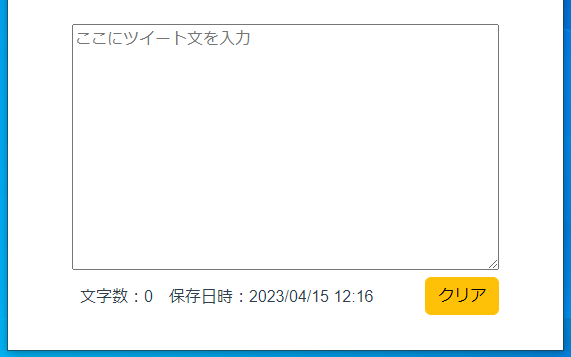
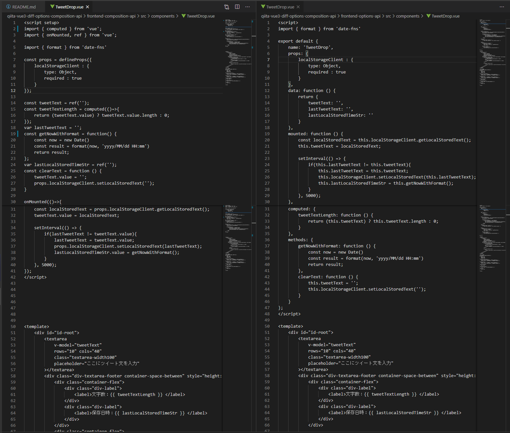

# タイトル

* Vue.js Version3系でのvueファイルの書き方と環境の作成方法

# 概要

Vue3でのVueファイル（SFCファイル）の書き方とトランスパイル方法（ビルドするための環境構築方法）を説明します。

* ※本記事では、以降「トランスパイル」を「build」と呼称します。
* ※ほぼ「自身向けのメモ」なので、悪しからず。


## 目的

本記事は、次を目的とします。

* Vue単一ファイルコンポーネント（ `*.vue`, Vue SFC）を用いてVueを記述する際の、buildコマンドと記述方法を分かった気になること。
* Vue2系と比較してVue3では何が変わったのか？を分かった気になること。
    * なお、Vue2とVue3の違いそのものは、すでに良質の解説記事があるので、そちらを参照ください（後述）。
* Veu2と同様の記法である「Options API」と、Vue3で推奨される「Composition API」とで、それぞれの記法の特徴的な差を理解すること


### Options API（Vue2での記法）の扱い

Veu3でも「Options API」は「引き続きサポート」されます。

> Options API は Vue の不可欠な要素であり、多くの開発者が Vue を愛する理由にもなっています。 
> Composition API の利点の多くは大規模プロジェクトでこそ現れるものであり、
> 多くの低~中程度の複雑性のシナリオにおいては 
> Options API が堅実な選択肢であり続けることも理解しています。

ref. https://ja.vuejs.org/guide/extras/composition-api-faq.html#will-options-api-be-deprecated


### Vue2とVue3の違い

次のサイトでの解説が分かり易いのでお勧めです。

* 【Vue 3】Vue 2との違いについて
    * [https://b1san-blog.com/post/vue/vue-3-introduction/](https://b1san-blog.com/post/vue/vue-3-introduction/)
* 正式リリース前に総予習!! Vue3の変更点まとめ
    * [https://qiita.com/ryo2132/items/3d0379e85c38a9a5b355](https://qiita.com/ryo2132/items/3d0379e85c38a9a5b355)
* 【Vue3】Vue2ユーザー向けVue3入門
    * [https://qiita.com/whopper1962/items/21caee0c649cd0a8151c](https://qiita.com/whopper1962/items/21caee0c649cd0a8151c)

Vue3から推奨となったComposition APIの解説は次のサイトがお勧めです。

* 【Vue 3】Composition API の基本
    * [https://b1san-blog.com/post/vue/vue-3-composition-api/](https://b1san-blog.com/post/vue/vue-3-composition-api/)


## 想定読者

想定読者は次の方です。

* Vue2で、Vue-Cli（ `@vue/cli` ）を用いてWebアプリを作成していた方
* Vue2からVue3への移行を始めようとする方


## サンプルコード

次のリポジトリから取得できます。

[https://github.com/hoshimado/qiita-notes/tree/main/qiita-vue3-diff-options-composition-api](https://github.com/hoshimado/qiita-notes/tree/main/qiita-vue3-diff-options-composition-api)


## 動作環境（検証環境）

サンプルコードの動作確認は次のバージョンで実施しました。

```package.json
  "dependencies": {
    "bootstrap": "^5.2.3",
    "date-fns": "^2.29.3",
    "vue": "^3.2.47"
  },
```

サンプルコードの実装の都合でBootStrapとdate-fansを利用しています。BootStrap-Vueではなく素のBootStrapを直接に使う形式としています[^1]。

[^1]: Vue3系への対応が未だ暫定的と思われるため。「 Important limitations: @vue-compat support is currently limited to { MODE: 2 } configuration both for compiler and Vue.js itself. You can find more details in compat configuration section of migration guide. 」https://bootstrap-vue.org/vue3


# Vue3での作成手順

## Vueプロジェクトの導入方法（CLIでbuildするコマンドを準備）

Vue3では、次のコマンドでVueプロジェクト（SFC形式の一式）を作成します。

```
npm init vue@latest
```

上記のコマンドを実行すると、「プロジェクト名」を最初に聞かれます。そこへ入力した「プロジェクト名」を用いてフォルダが作成されて、その配下にVueプロジェクトが作成される仕様です。

Vue2の時の下記のように事前にVue-CLI（ '@vue/cli` ）をインストールする必要はありません。

```
npm install @vue/cli
npx vue create [作成するプロジェクトのフォルダ名]
```

ここで
「 `npm init <initializer>` 」 
は、`initializer` で指定したnpmパッケージで定義されている
初期化処理を実行するコマンドです。

ref. https://docs.npmjs.com/cli/v9/commands/npm-init

> npm init <initializer> can be used to set up a new or existing npm package.
> 
> initializer in this case is an npm package named create-<initializer>, 
> which will be installed by npm-exec, and then have 
> its main bin executed -- presumably creating or updating package.json 
> and running any other initialization-related operations.
>
> The init command is transformed to a corresponding npm exec operation as follows:
> 
> * npm init foo -> npm exec create-foo
> * npm init @usr/foo -> npm exec @usr/create-foo


「 `npm init vue@latest` 」コマンドを実行した際に入力する内容の説明に戻ります。

初回実行時は、vueの初期化用パッケージの取得を確認してくるので、
yを押下します。

```
Need to install the following packages:
  create-vue@latest
Ok to proceed? (y)
```

その後に続く質問は、Vueプロジェクトのオプション設定です。本記事では簡単のため、Lintのみ「Yes」としてそれ以外は全て「No」とします。なおデフォルト値は何れも「No」です。

```
Vue.js - The Progressive JavaScript Framework

√ Project name: ... frontend
√ Add TypeScript? ... -No- / Yes
√ Add JSX Support? ... -No- / Yes
√ Add Vue Router for Single Page Application development? ... -No- / Yes
√ Add Pinia for state management? ... -No- / Yes
√ Add Vitest for Unit Testing? ... -No- / Yes
√ Add an End-to-End Testing Solution? ≫ -No-
√ Add ESLint for code quality? ... No / -Yes-
√ Add Prettier for code formatting? ... -No- / Yes

Scaffolding project in D:\AsGitHub\vue3trial\frontend\vue-project...

Done. Now run:

  cd frontend
  npm install
  npm run dev
```

コマンド実行が完了すると、「Project name」で入力したフォルダが作成され、その配下にVueプロジェクトが作成されています。Vue2の際と同様にデモコードが格納されているので、上記の表示に従って `npm run dev` で動作を確認できます。


## Vue3でのVueファイルの記述方法（SFCファイルの記述方法）

デモ画面の説明は他のサイトに譲り[^2][^3]、本記事では次の機能を有した[サンプルコード](#サンプルコード)を用いて記述方法を説明します。

* 入力したテキストの文字列をカウントするWebアプリ
* 入力したテキストはブラウザのローカル領域に自動保存される

[^2]: 今日から始めるVue.js 3を学んで本格的なWebフロントエンド開発(基礎編), https://reffect.co.jp/vue/beginner-vue

[^3]: 【完全解説】create-vueでVue3プロジェクト作成～Vite爆速開発～, https://reffect.co.jp/vue/create-vue

実装の設計概要は次の構造の通りです。
Componet間での親→子のデータ渡しを含む例とするため、
`App.vue`で、`utils/localStorageClinet.js` を読み込んで
`new`したインスタンスを渡して、`TweetDrop.vue`で利用する形としています。

```
frontend
├─node_modules\
├─public\
└─src
    ├─App.vue
    ├─assets\
    ├─components\
    ｜   ├─MyClient.vue
    ｜   └─TweetDrop.vue
    └─utils\
    　   └─localStorageClient.js
```

[サンプルコード](#サンプルコード)のUIはこちらです。




### Ver2準拠のOptions API記法

Vue3でも、Vue2と同じ記法で記述できます。
この記述方法を「Options API」と呼びます。

今回のサンプルでは`App.vue`と`TweetDrop.vue`を次のように実装しています（Css部分は省略）。
コードの全体像は、「[サンプルコード](#サンプルコード)」の節からリポジトリを参照ください。
ここで注目してほしいのは、実装方法**ではなく**、次の2点です。

* Vue3でも、Vue2と全く同じ記法を用いれること（Options API）
* 次の節で例示する、Composition API記法との違い


```App.vue
<script>
import LocalStorageClient from './utils/localStorageClient.js';
import MyClient from './components/MyClient.vue';

export default {
    name: 'app',
    components: {
        MyClient
    },
    data: function () {
        return {
            localStorageClient: new LocalStorageClient(window)
        }
    }
}
</script>

<template>
  <div id="app">
    <MyClient 
      v-bind:localStorageClient="localStorageClient"
    >
    </MyClient>
  </div>
</template>
```


```TweetDrop.vue
<script>
import { format } from 'date-fns'

export default {
    name: 'TweetDrop',
    props: {
        localStorageClient : {
            type: Object,
            required : true
        }
    },
    data: function () {
        return {
            tweetText: '',
            lastTweetText: '',
            lastLocalStoredTimeStr: ''
        }
    },
    mounted: function () {
        const localStoredText = this.localStorageClient.getLocalStoredText();
        this.tweetText = localStoredText;

        setInterval(() => {
            if(this.lastTweetText != this.tweetText){
                this.lastTweetText = this.tweetText;
                this.localStorageClient.setLocalStoredText(this.lastTweetText);
                this.lastLocalStoredTimeStr = this.getNowWithFormat();
            }
        }, 5000);
    },
    computed: {
        tweetTextLength: function () {
            return (this.tweetText) ? this.tweetText.length : 0;
        }
    },
    methods: {
        getNowWithFormat: function () {
            const now = new Date()
            const result = format(now, 'yyyy/MM/dd HH:mm')
            return result;
        },
        clearText: function () {
            this.tweetText = '';
            this.localStorageClient.setLocalStoredText('');
        }
    }
};
</script>

<template>
    <div id="id-root">
        <textarea 
            v-model="tweetText"
            rows="10" cols="40" 
            class="textarea-width100"
            placeholder="ここにツイート文を入力"
        ></textarea>
        <div class="div-textarea-footer container-space-between" style="height: 50px;">
            <div class="container-flex">
                <div class="div-label">
                    <label>文字数：{{ tweetTextLength }} </label>
                </div>
                <div class="div-label">
                    <label>保存日時：{{ lastLocalStoredTimeStr }} </label>
                </div>
            </div>

            <div class="container-flex">
                <div>
                    <button type="button" class="btn btn-warning" v-on:click="clearText">クリア</button>
                </div>
            </div>
        </div> 
    </div>
</template>
```


### Ver3から推奨となったComposition API記法

Vue3では「Composition API」という記法が推奨され、
デモ画面の実装もこのComposition APIで記述されています。

今回のサンプルを、Composition APIで書き直すと、以下となります（こちらもCss部分は省略）。

```App.vue
<script setup>
import { reactive } from 'vue';
import LocalStorageClient from './utils/localStorageClient.js';
import MyClient from './components/MyClient.vue';

const localStorageClient = reactive(new LocalStorageClient(window));
</script>

<template>
  <div id="app">
    <MyClient 
      v-bind:localStorageClient="localStorageClient"
    >
    </MyClient>
  </div>
</template>
```


```TweetDrop.vue
<script setup>
import { computed } from 'vue';
import { onMounted, ref } from 'vue';

import { format } from 'date-fns'

const props = defineProps({
    localStorageClient : {
        type: Object,
        required : true
    }
});

const tweetText = ref('');
const tweetTextLength = computed(()=>{
    return (tweetText.value) ? tweetText.value.length : 0;
});
var lastTweetText = '';
const getNowWithFormat = function() {
    const now = new Date()
    const result = format(now, 'yyyy/MM/dd HH:mm')
    return result;
};
var lastLocalStoredTimeStr = ref('');
const clearText = function () {
    tweetText.value = '';
    props.localStorageClient.setLocalStoredText('');
}

onMounted(()=>{
    const localStoredText = props.localStorageClient.getLocalStoredText();
    tweetText.value = localStoredText;

    setInterval(() => {
        if(lastTweetText != tweetText.value){
            lastTweetText = tweetText.value;
            props.localStorageClient.setLocalStoredText(lastTweetText);
            lastLocalStoredTimeStr.value = getNowWithFormat();
        }
    }, 5000);
});
</script>

<template>
    <div id="id-root">
        <textarea 
            v-model="tweetText"
            rows="10" cols="40" 
            class="textarea-width100"
            placeholder="ここにツイート文を入力"
        ></textarea>
        <div class="div-textarea-footer container-space-between" style="height: 50px;">
            <div class="container-flex">
                <div class="div-label">
                    <label>文字数：{{ tweetTextLength }} </label>
                </div>
                <div class="div-label">
                    <label>保存日時：{{ lastLocalStoredTimeStr }} </label>
                </div>
            </div>
            <div class="container-flex">
                <div>
                    <button type="button" class="btn btn-warning" v-on:click="clearText">クリア</button>
                </div>
            </div>
        </div> 
    </div>
</template>
```


### Options API記法と Composition API記法の比較

それぞれの記法の特徴などの説明は、他のサイトに譲ります。節「[Vue2とVue3の違い](#Vue2とVue3の違い)」で紹介した記事が良くまとまっているのでお勧めです。


詳細は上記の記事に書いてある通りですが、ザッとサンプルコードの
`TweetDrop.vue`で比較してみると、次のようになります。左がComposition API記法で、右がOptions API記法です。
見ての通り、`<template>`タグ内は同一（後半は省略）です。異なるのは
`<script>`タグの中となります。



なんとなく「どう置き換わるか？」が分かるのではないでしょうか。Options API記法を知っている人がComposition API記法に移行するのは特にハードルは無いかと思います。このサンプルの範囲での移行時の注意点としては、次の部分です。

* `defineProps()`で親コンポーネントから渡されたプロパティに`<script setup>`タグ内でアクセスするには、明示的に`const props = defineProps()`で宣言しておき、`props.XXX`の形でアクセスする必要があること。
* 一方で、`<templaｔe>`タグ内でアクセスする場合は、`props`への代入を省略して、`XXX`に直にアクセス可能。たとえば`MyClient.vue`では次のように`<template>`タグ内のみのアクセスのため省略した表記が可能。

```MyClient.vue
<script setup>
import TweetDrop from './TweetDrop.vue';
import { onMounted, ref } from 'vue';

defineProps({
    localStorageClient : {
        type: Object,
        required : true
    }
});

const isCreating1st = ref(true);
const isSignup = ref(false);

onMounted(()=>{
    setTimeout(() => {
        isCreating1st.value = false;
        isSignup.value = true;
    }, 1000);
});
</script>
```

#### Propsの扱い

公式ガイドでは、`<script setup>`タグ内でPropsにアクセスする場合の記法として次のサンプルコードが記載されています。

ref. https://vuejs.org/api/sfc-script-setup.html#defineprops-defineemits

```
<script setup>
const props = defineProps({
  foo: String
})
```

`<template>`タグ内のみでのPropsアクセスの例は記載が見当たりませんが、仕様として次の記載があります。実際、`definePoprs()`の戻り値変数を経由することなく、Propsに直接アクセスが可能です。

ref. https://vuejs.org/api/sfc-spec.html#script-setup

> 
> Top-level bindings in \<script setup\> are automatically exposed to the template. For more details
>


## 実行方法（build方法）

Vue3では、Vue2での`npm run serve`コマンドに代わり、
`npm run dev`を用いる。

サンプルコードでは
`frontend-options-api` フォルダ、
`frontend-composition-api` フォルダ、
それぞれで次のコマンドを実行するとデバッグ実行できる。
もちろん`npm install`は初回のみで良い。

```
  npm install
  npm run dev
```


以上ー。

（正式buildのコマンドは`npm run build`で変わらないので省略。buildオプションの指定方法には変更があるので、公式ガイドを参照のこと）

